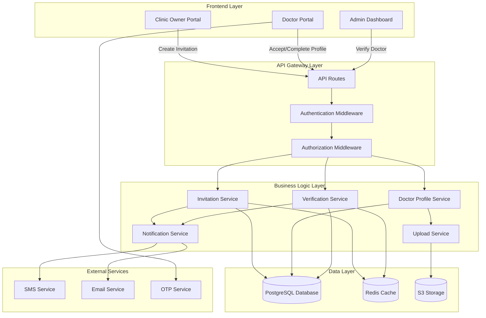
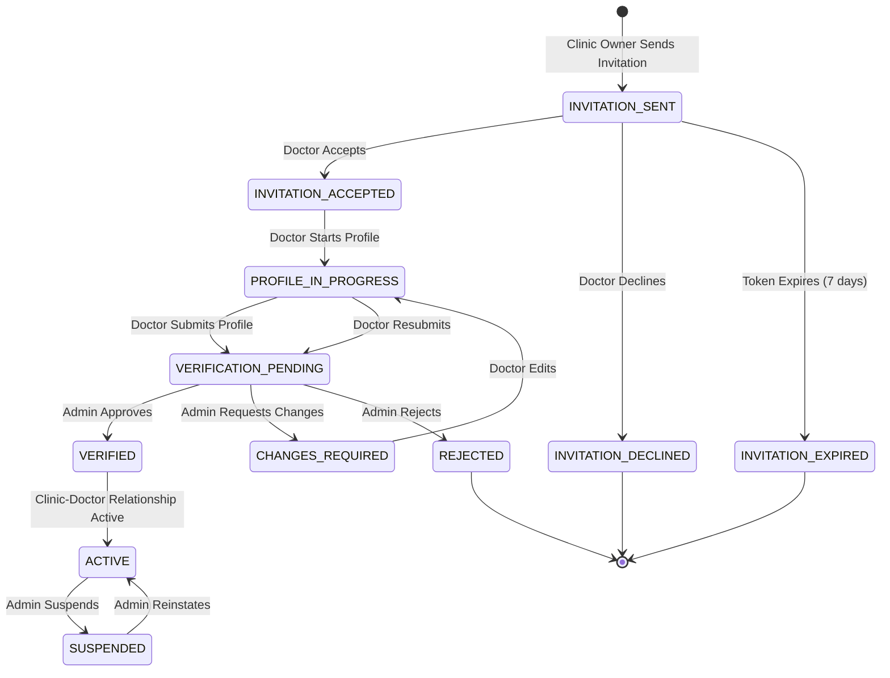
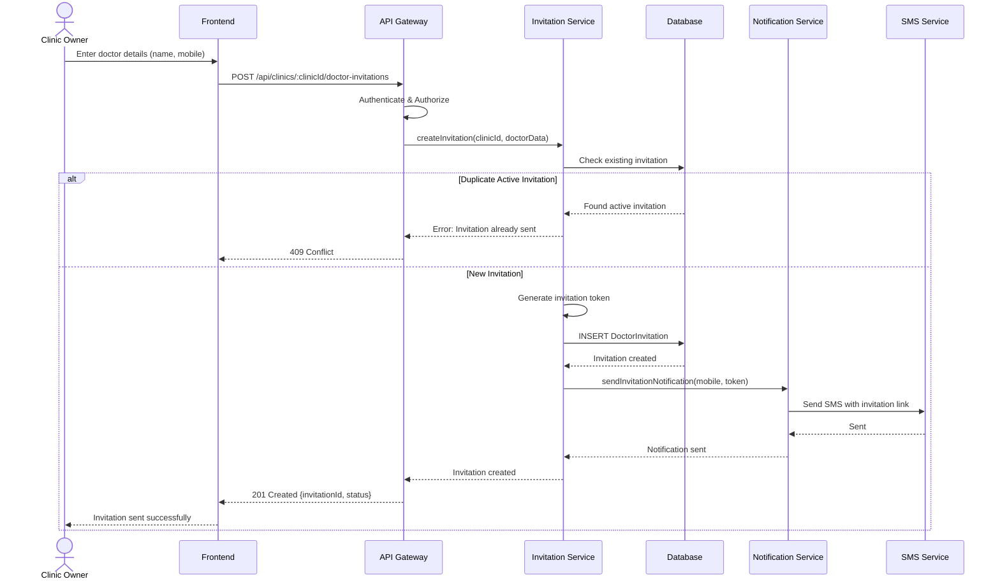
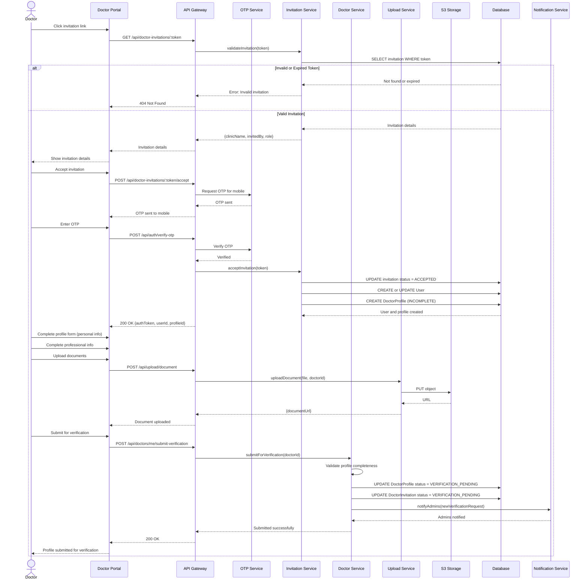
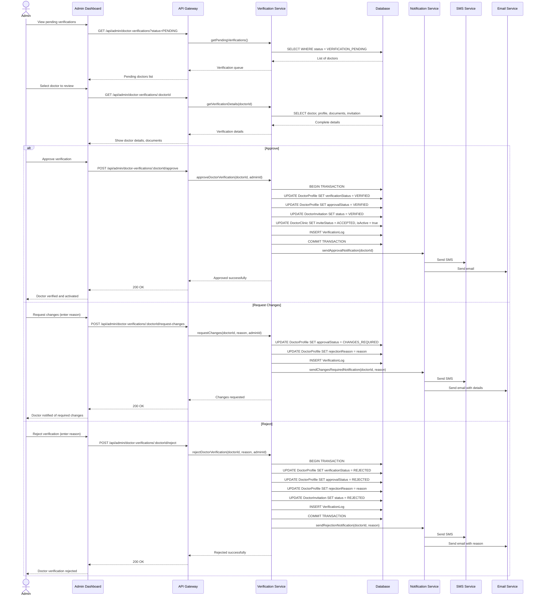

# Design Document: Doctor Invitation and Verification Workflow

## Overview

This document provides a comprehensive technical design for redesigning the doctor onboarding workflow in PulseMate. The current system allows clinic owners to directly add doctors with full credentials, posing verification risks. The redesigned workflow implements a secure three-party verification process: **Clinic Owner initiates** (minimal input), **Doctor completes profile** (with professional credentials), and **PulseMate Admin verifies** (validates documents and registration).

The new workflow ensures proper credential verification, reduces clinic owner burden, maintains data integrity, and provides clear status tracking throughout the onboarding process. This design includes comprehensive architecture diagrams, state machines, sequence flows, database schema changes, and API specifications.

## Architecture

### System Component Architecture




### Component Responsibilities

**Frontend Layer:**
- **Clinic Owner Portal**: Interface for sending doctor invitations with minimal required fields
- **Doctor Portal**: Multi-step profile completion interface with document upload
- **Admin Dashboard**: Verification interface with document review and approval workflow

**API Gateway Layer:**
- **API Routes**: RESTful endpoints for invitation, profile, and verification operations
- **Authentication Middleware**: JWT-based authentication validation
- **Authorization Middleware**: Role-based access control (Clinic Owner, Doctor, Admin)

**Business Logic Layer:**
- **Invitation Service**: Manages invitation creation, token generation, and invitation status
- **Doctor Profile Service**: Handles profile completion, document upload, and validation
- **Verification Service**: Admin verification workflow, status transitions, rejection handling
- **Notification Service**: SMS/Email notifications for invitations and status updates
- **Upload Service**: Secure document upload to S3 with validation

**Data Layer:**
- **PostgreSQL Database**: Persistent storage for invitations, profiles, verification logs
- **Redis Cache**: Invitation tokens, OTP sessions, verification queues
- **S3 Storage**: Secure document storage with expiring signed URLs

**External Services:**
- **SMS Service**: OTP delivery for doctor authentication
- **Email Service**: Invitation links and status notifications
- **OTP Service**: Firebase Phone Auth for doctor mobile verification


## Workflow State Machine

### Doctor Invitation and Verification States




### State Definitions

| State | Description | Allowed Transitions | Actors |
|-------|-------------|---------------------|--------|
| **INVITATION_SENT** | Clinic owner has sent invitation; doctor notified | ACCEPTED, DECLINED, EXPIRED | Doctor |
| **INVITATION_ACCEPTED** | Doctor accepted invitation; ready to complete profile | PROFILE_IN_PROGRESS | Doctor |
| **INVITATION_DECLINED** | Doctor declined invitation; terminal state | None | N/A |
| **INVITATION_EXPIRED** | Invitation token expired (7 days); terminal state | None | N/A |
| **PROFILE_IN_PROGRESS** | Doctor is filling out profile and uploading documents | VERIFICATION_PENDING | Doctor |
| **VERIFICATION_PENDING** | Profile submitted; awaiting admin review | VERIFIED, CHANGES_REQUIRED, REJECTED | Admin |
| **CHANGES_REQUIRED** | Admin requested profile modifications | PROFILE_IN_PROGRESS | Doctor |
| **VERIFIED** | Admin approved credentials; doctor verified | ACTIVE | System |
| **REJECTED** | Admin rejected; verification failed; terminal state | None | N/A |
| **ACTIVE** | Doctor-clinic relationship is active; visible to patients | SUSPENDED | Admin |
| **SUSPENDED** | Doctor temporarily suspended; not visible to patients | ACTIVE | Admin |

## Sequence Diagrams

### 1. Clinic Owner Sends Invitation




### 2. Doctor Accepts Invitation and Completes Profile




### 3. Admin Verifies Doctor Profile




## Data Models

### Database Schema Changes

#### 1. New Table: DoctorInvitation

```sql
CREATE TABLE doctor_invitations (
  id                UUID PRIMARY KEY DEFAULT gen_random_uuid(),
  clinic_id         UUID NOT NULL REFERENCES clinics(id) ON DELETE CASCADE,
  invited_by_id     UUID NOT NULL REFERENCES users(id),
  
  -- Minimal input from clinic owner
  doctor_name       VARCHAR(255) NOT NULL,
  doctor_mobile     VARCHAR(20) NOT NULL,
  doctor_email      VARCHAR(255),
  specialization    VARCHAR(255),
  
  -- Invitation management
  invitation_token  VARCHAR(255) UNIQUE NOT NULL,
  token_expires_at  TIMESTAMP NOT NULL,
  status            VARCHAR(50) NOT NULL DEFAULT 'INVITATION_SENT',
  
  -- Doctor response
  accepted_at       TIMESTAMP,
  declined_at       TIMESTAMP,
  declined_reason   TEXT,
  
  -- Created doctor reference (after acceptance)
  doctor_user_id    UUID REFERENCES users(id),
  doctor_profile_id UUID REFERENCES doctor_profiles(id),
  
  -- Verification tracking
  submitted_at      TIMESTAMP,
  verified_at       TIMESTAMP,
  verified_by_id    UUID REFERENCES users(id),
  rejected_at       TIMESTAMP,
  rejected_by_id    UUID REFERENCES users(id),
  rejection_reason  TEXT,
  
  -- Timestamps
  created_at        TIMESTAMP NOT NULL DEFAULT NOW(),
  updated_at        TIMESTAMP NOT NULL DEFAULT NOW(),
  
  -- Indexes
  CONSTRAINT chk_status CHECK (status IN (
    'INVITATION_SENT',
    'INVITATION_ACCEPTED',
    'INVITATION_DECLINED',
    'INVITATION_EXPIRED',
    'PROFILE_IN_PROGRESS',
    'VERIFICATION_PENDING',
    'CHANGES_REQUIRED',
    'VERIFIED',
    'REJECTED'
  ))
);

CREATE INDEX idx_doctor_invitations_clinic ON doctor_invitations(clinic_id);
CREATE INDEX idx_doctor_invitations_mobile ON doctor_invitations(doctor_mobile);
CREATE INDEX idx_doctor_invitations_token ON doctor_invitations(invitation_token);
CREATE INDEX idx_doctor_invitations_status ON doctor_invitations(status);
CREATE INDEX idx_doctor_invitations_created ON doctor_invitations(created_at DESC);
```


#### 2. New Table: DoctorVerificationDocuments

```sql
CREATE TABLE doctor_verification_documents (
  id                     UUID PRIMARY KEY DEFAULT gen_random_uuid(),
  doctor_profile_id      UUID NOT NULL REFERENCES doctor_profiles(id) ON DELETE CASCADE,
  
  -- Document metadata
  document_type          VARCHAR(100) NOT NULL,
  document_category      VARCHAR(100) NOT NULL,
  file_name              VARCHAR(255) NOT NULL,
  file_size              BIGINT NOT NULL,
  mime_type              VARCHAR(100) NOT NULL,
  
  -- Storage
  storage_url            TEXT NOT NULL,
  storage_key            VARCHAR(500) NOT NULL,
  
  -- Verification
  verification_status    VARCHAR(50) DEFAULT 'PENDING',
  verified_by_id         UUID REFERENCES users(id),
  verified_at            TIMESTAMP,
  rejection_reason       TEXT,
  
  -- Metadata
  uploaded_at            TIMESTAMP NOT NULL DEFAULT NOW(),
  created_at             TIMESTAMP NOT NULL DEFAULT NOW(),
  updated_at             TIMESTAMP NOT NULL DEFAULT NOW(),
  
  CONSTRAINT chk_document_type CHECK (document_type IN (
    'MEDICAL_REGISTRATION_CERTIFICATE',
    'QUALIFICATION_CERTIFICATE',
    'ADDITIONAL_QUALIFICATION',
    'IDENTITY_PROOF',
    'OTHER'
  )),
  
  CONSTRAINT chk_verification_status CHECK (verification_status IN (
    'PENDING',
    'VERIFIED',
    'REJECTED'
  ))
);

CREATE INDEX idx_doctor_docs_profile ON doctor_verification_documents(doctor_profile_id);
CREATE INDEX idx_doctor_docs_type ON doctor_verification_documents(document_type);
CREATE INDEX idx_doctor_docs_status ON doctor_verification_documents(verification_status);
```


#### 3. Modified Table: DoctorProfile (Add New Fields)

```sql
ALTER TABLE doctor_profiles ADD COLUMN IF NOT EXISTS full_legal_name VARCHAR(255);
ALTER TABLE doctor_profiles ADD COLUMN IF NOT EXISTS date_of_birth DATE;
ALTER TABLE doctor_profiles ADD COLUMN IF NOT EXISTS medical_system VARCHAR(100);
ALTER TABLE doctor_profiles ADD COLUMN IF NOT EXISTS registration_authority VARCHAR(255);
ALTER TABLE doctor_profiles ADD COLUMN IF NOT EXISTS registration_year INTEGER;
ALTER TABLE doctor_profiles ADD COLUMN IF NOT EXISTS profile_photo_url TEXT;
ALTER TABLE doctor_profiles ADD COLUMN IF NOT EXISTS invitation_id UUID REFERENCES doctor_invitations(id);
ALTER TABLE doctor_profiles ADD COLUMN IF NOT EXISTS profile_completion_percentage INTEGER DEFAULT 0;
ALTER TABLE doctor_profiles ADD COLUMN IF NOT EXISTS profile_submitted_at TIMESTAMP;
ALTER TABLE doctor_profiles ADD COLUMN IF NOT EXISTS last_edited_at TIMESTAMP;

CREATE INDEX idx_doctor_profiles_invitation ON doctor_profiles(invitation_id);
CREATE INDEX idx_doctor_profiles_verification ON doctor_profiles(verification_status);
CREATE INDEX idx_doctor_profiles_submitted ON doctor_profiles(profile_submitted_at);
```

#### 4. Modified Table: DoctorClinic (Add Verification Tracking)

```sql
ALTER TABLE clinic_doctors ADD COLUMN IF NOT EXISTS invitation_accepted_at TIMESTAMP;
ALTER TABLE clinic_doctors ADD COLUMN IF NOT EXISTS verification_submitted_at TIMESTAMP;
ALTER TABLE clinic_doctors ADD COLUMN IF NOT EXISTS admin_verified_at TIMESTAMP;
ALTER TABLE clinic_doctors ADD COLUMN IF NOT EXISTS admin_verified_by_id UUID REFERENCES users(id);
ALTER TABLE clinic_doctors ADD COLUMN IF NOT EXISTS changes_requested_at TIMESTAMP;
ALTER TABLE clinic_doctors ADD COLUMN IF NOT EXISTS changes_requested_reason TEXT;

CREATE INDEX idx_clinic_doctors_invite_status ON clinic_doctors(invite_status);
CREATE INDEX idx_clinic_doctors_active ON clinic_doctors(is_active);
```


#### 5. New Table: DoctorVerificationLog

```sql
CREATE TABLE doctor_verification_logs (
  id               UUID PRIMARY KEY DEFAULT gen_random_uuid(),
  doctor_profile_id UUID NOT NULL REFERENCES doctor_profiles(id) ON DELETE CASCADE,
  admin_id         UUID REFERENCES users(id),
  
  -- State transition
  old_status       VARCHAR(50) NOT NULL,
  new_status       VARCHAR(50) NOT NULL,
  
  -- Details
  action           VARCHAR(100) NOT NULL,
  reason           TEXT,
  admin_notes      TEXT,
  
  -- Metadata
  created_at       TIMESTAMP NOT NULL DEFAULT NOW(),
  
  CONSTRAINT chk_action CHECK (action IN (
    'INVITATION_SENT',
    'INVITATION_ACCEPTED',
    'INVITATION_DECLINED',
    'PROFILE_SUBMITTED',
    'ADMIN_APPROVED',
    'ADMIN_REQUESTED_CHANGES',
    'ADMIN_REJECTED',
    'DOCTOR_RESUBMITTED',
    'PROFILE_UPDATED'
  ))
);

CREATE INDEX idx_doctor_verification_logs_profile ON doctor_verification_logs(doctor_profile_id);
CREATE INDEX idx_doctor_verification_logs_admin ON doctor_verification_logs(admin_id);
CREATE INDEX idx_doctor_verification_logs_created ON doctor_verification_logs(created_at DESC);
```

### Prisma Schema Updates

```prisma
model DoctorInvitation {
  id                String    @id @default(uuid())
  clinicId          String
  invitedById       String
  
  // Minimal input from clinic owner
  doctorName        String
  doctorMobile      String
  doctorEmail       String?
  specialization    String?
  
  // Invitation management
  invitationToken   String    @unique
  tokenExpiresAt    DateTime
  status            DoctorInvitationStatus @default(INVITATION_SENT)
  
  // Doctor response
  acceptedAt        DateTime?
  declinedAt        DateTime?
  declinedReason    String?
  
  // Created doctor reference
  doctorUserId      String?
  doctorProfileId   String?
  
  // Verification tracking
  submittedAt       DateTime?
  verifiedAt        DateTime?
  verifiedById      String?
  rejectedAt        DateTime?
  rejectedById      String?
  rejectionReason   String?
  
  // Timestamps
  createdAt         DateTime  @default(now())
  updatedAt         DateTime  @updatedAt
  
  // Relations
  clinic            Clinic    @relation(fields: [clinicId], references: [id], onDelete: Cascade)
  invitedBy         User      @relation("InvitedByUser", fields: [invitedById], references: [id])
  doctorUser        User?     @relation("DoctorInvitationUser", fields: [doctorUserId], references: [id])
  doctorProfile     DoctorProfile? @relation(fields: [doctorProfileId], references: [id])
  verifiedBy        User?     @relation("VerifiedByAdmin", fields: [verifiedById], references: [id])
  rejectedBy        User?     @relation("RejectedByAdmin", fields: [rejectedById], references: [id])
  
  @@index([clinicId])
  @@index([doctorMobile])
  @@index([invitationToken])
  @@index([status])
  @@index([createdAt])
  @@map("doctor_invitations")
}


enum DoctorInvitationStatus {
  INVITATION_SENT
  INVITATION_ACCEPTED
  INVITATION_DECLINED
  INVITATION_EXPIRED
  PROFILE_IN_PROGRESS
  VERIFICATION_PENDING
  CHANGES_REQUIRED
  VERIFIED
  REJECTED
}

model DoctorVerificationDocument {
  id                  String    @id @default(uuid())
  doctorProfileId     String
  
  // Document metadata
  documentType        String
  documentCategory    String
  fileName            String
  fileSize            BigInt
  mimeType            String
  
  // Storage
  storageUrl          String
  storageKey          String
  
  // Verification
  verificationStatus  DocumentVerificationStatus @default(PENDING)
  verifiedById        String?
  verifiedAt          DateTime?
  rejectionReason     String?
  
  // Timestamps
  uploadedAt          DateTime  @default(now())
  createdAt           DateTime  @default(now())
  updatedAt           DateTime  @updatedAt
  
  // Relations
  doctorProfile       DoctorProfile @relation(fields: [doctorProfileId], references: [id], onDelete: Cascade)
  verifiedBy          User?     @relation(fields: [verifiedById], references: [id])
  
  @@index([doctorProfileId])
  @@index([documentType])
  @@index([verificationStatus])
  @@map("doctor_verification_documents")
}

enum DocumentVerificationStatus {
  PENDING
  VERIFIED
  REJECTED
}

model DoctorVerificationLog {
  id              String    @id @default(uuid())
  doctorProfileId String
  adminId         String?
  
  // State transition
  oldStatus       String
  newStatus       String
  
  // Details
  action          String
  reason          String?
  adminNotes      String?
  
  // Timestamp
  createdAt       DateTime  @default(now())
  
  // Relations
  doctorProfile   DoctorProfile @relation(fields: [doctorProfileId], references: [id], onDelete: Cascade)
  admin           User?     @relation(fields: [adminId], references: [id])
  
  @@index([doctorProfileId])
  @@index([adminId])
  @@index([createdAt])
  @@map("doctor_verification_logs")
}
```


## API Endpoints Specification

### Clinic Owner Endpoints

#### 1. Create Doctor Invitation

**Endpoint:** `POST /api/clinics/:clinicId/doctor-invitations`

**Authentication:** Required (JWT)

**Authorization:** CLINIC_OWNER, SUPER_ADMIN

**Request Headers:**
```http
Authorization: Bearer <jwt_token>
Content-Type: application/json
```

**Request Body:**
```json
{
  "doctorName": "Dr. Rajesh Kumar",
  "doctorMobile": "+919876543210",
  "doctorEmail": "rajesh.kumar@example.com",
  "specialization": "Cardiology"
}
```

**Validation Rules:**
- `doctorName`: Required, string, 2-255 characters
- `doctorMobile`: Required, valid Indian mobile format (+91XXXXXXXXXX or 10 digits)
- `doctorEmail`: Optional, valid email format
- `specialization`: Optional, string, max 255 characters
- Clinic must be VERIFIED
- No duplicate active invitation for same mobile + clinic

**Success Response (201 Created):**
```json
{
  "success": true,
  "data": {
    "invitationId": "123e4567-e89b-12d3-a456-426614174000",
    "doctorName": "Dr. Rajesh Kumar",
    "doctorMobile": "+919876543210",
    "status": "INVITATION_SENT",
    "invitationLink": "https://app.pulsemate.in/doctor-invite/abc123token",
    "expiresAt": "2024-02-07T10:30:00Z",
    "createdAt": "2024-01-31T10:30:00Z"
  },
  "message": "Invitation sent successfully"
}
```

**Error Responses:**

```json
// 400 Bad Request - Validation Error
{
  "success": false,
  "error": {
    "code": "VALIDATION_ERROR",
    "message": "Invalid mobile number format"
  }
}

// 409 Conflict - Duplicate Invitation
{
  "success": false,
  "error": {
    "code": "DUPLICATE_INVITATION",
    "message": "An active invitation already exists for this doctor at this clinic"
  }
}

// 403 Forbidden - Clinic Not Verified
{
  "success": false,
  "error": {
    "code": "CLINIC_NOT_VERIFIED",
    "message": "Your clinic must be verified before inviting doctors"
  }
}
```


#### 2. Get Clinic Doctor Invitations

**Endpoint:** `GET /api/clinics/:clinicId/doctor-invitations`

**Authentication:** Required (JWT)

**Authorization:** CLINIC_OWNER, SUPER_ADMIN

**Query Parameters:**
- `status`: Optional filter (INVITATION_SENT, ACCEPTED, VERIFIED, etc.)
- `page`: Optional, default 1
- `limit`: Optional, default 20

**Success Response (200 OK):**
```json
{
  "success": true,
  "data": {
    "invitations": [
      {
        "invitationId": "123e4567-e89b-12d3-a456-426614174000",
        "doctorName": "Dr. Rajesh Kumar",
        "doctorMobile": "+919876543210",
        "specialization": "Cardiology",
        "status": "VERIFICATION_PENDING",
        "invitedAt": "2024-01-31T10:30:00Z",
        "acceptedAt": "2024-02-01T14:20:00Z",
        "submittedAt": "2024-02-02T09:15:00Z"
      }
    ],
    "pagination": {
      "page": 1,
      "limit": 20,
      "total": 45,
      "totalPages": 3
    }
  }
}
```

#### 3. Resend Invitation

**Endpoint:** `POST /api/clinics/:clinicId/doctor-invitations/:invitationId/resend`

**Authentication:** Required (JWT)

**Authorization:** CLINIC_OWNER, SUPER_ADMIN

**Success Response (200 OK):**
```json
{
  "success": true,
  "data": {
    "invitationId": "123e4567-e89b-12d3-a456-426614174000",
    "newExpiresAt": "2024-02-14T10:30:00Z"
  },
  "message": "Invitation resent successfully"
}
```


### Doctor Endpoints

#### 4. Get Invitation Details (Public - Token Based)

**Endpoint:** `GET /api/doctor-invitations/:token`

**Authentication:** Not required (uses token)

**Success Response (200 OK):**
```json
{
  "success": true,
  "data": {
    "invitationId": "123e4567-e89b-12d3-a456-426614174000",
    "clinicName": "City Heart Clinic",
    "clinicAddress": "123 MG Road, Bangalore, Karnataka 560001",
    "invitedBy": "Dr. Suresh Reddy",
    "invitedRole": "Doctor",
    "specialization": "Cardiology",
    "status": "INVITATION_SENT",
    "expiresAt": "2024-02-07T10:30:00Z"
  }
}
```

**Error Response (404 Not Found):**
```json
{
  "success": false,
  "error": {
    "code": "INVALID_INVITATION",
    "message": "Invitation not found or has expired"
  }
}
```

#### 5. Accept Invitation

**Endpoint:** `POST /api/doctor-invitations/:token/accept`

**Authentication:** OTP-based (requires phone verification)

**Request Body:**
```json
{
  "otp": "123456",
  "verificationId": "firebase-verification-id"
}
```

**Success Response (200 OK):**
```json
{
  "success": true,
  "data": {
    "authToken": "eyJhbGciOiJIUzI1NiIsInR5cCI6IkpXVCJ9...",
    "refreshToken": "refresh_token_here",
    "userId": "456e7890-e89b-12d3-a456-426614174001",
    "profileId": "789e0123-e89b-12d3-a456-426614174002",
    "mobile": "+919876543210",
    "role": "DOCTOR",
    "profileStatus": "INCOMPLETE",
    "nextStep": "COMPLETE_PROFILE"
  },
  "message": "Invitation accepted successfully"
}
```


#### 6. Decline Invitation

**Endpoint:** `POST /api/doctor-invitations/:token/decline`

**Authentication:** Not required (uses token)

**Request Body:**
```json
{
  "reason": "Already practicing at another clinic"
}
```

**Success Response (200 OK):**
```json
{
  "success": true,
  "message": "Invitation declined"
}
```

#### 7. Update Doctor Profile

**Endpoint:** `PATCH /api/doctors/me/profile`

**Authentication:** Required (JWT)

**Authorization:** DOCTOR

**Request Body:**
```json
{
  "fullLegalName": "Dr. Rajesh Kumar M",
  "dateOfBirth": "1985-05-15",
  "gender": "MALE",
  "profilePhoto": "data:image/jpeg;base64,...",
  "medicalSystem": "MODERN_MEDICINE",
  "qualification": "MBBS, MD",
  "specialization": "Cardiology",
  "medicalRegistrationNumber": "KMC123456",
  "registrationAuthority": "Karnataka Medical Council",
  "registrationYear": 2010,
  "experienceYears": 14,
  "languagesKnown": ["English", "Hindi", "Kannada"],
  "bio": "Experienced cardiologist with 14 years of practice",
  "consultationFee": 500
}
```

**Success Response (200 OK):**
```json
{
  "success": true,
  "data": {
    "profileId": "789e0123-e89b-12d3-a456-426614174002",
    "profileStatus": "INCOMPLETE",
    "profileCompletionPercentage": 65,
    "missingFields": ["documents"],
    "updatedAt": "2024-02-01T15:30:00Z"
  },
  "message": "Profile updated successfully"
}
```


#### 8. Upload Verification Document

**Endpoint:** `POST /api/doctors/me/documents`

**Authentication:** Required (JWT)

**Authorization:** DOCTOR

**Request Headers:**
```http
Authorization: Bearer <jwt_token>
Content-Type: multipart/form-data
```

**Request Body (Multipart):**
```
documentType: MEDICAL_REGISTRATION_CERTIFICATE
documentCategory: REGISTRATION
file: [binary file data]
```

**Validation Rules:**
- Allowed file types: PDF, JPG, JPEG, PNG
- Max file size: 5MB
- Document type must be valid enum value

**Success Response (201 Created):**
```json
{
  "success": true,
  "data": {
    "documentId": "890e1234-e89b-12d3-a456-426614174003",
    "documentType": "MEDICAL_REGISTRATION_CERTIFICATE",
    "fileName": "registration_certificate.pdf",
    "fileSize": 1048576,
    "uploadedAt": "2024-02-02T08:45:00Z",
    "verificationStatus": "PENDING"
  },
  "message": "Document uploaded successfully"
}
```

**Error Response (400 Bad Request):**
```json
{
  "success": false,
  "error": {
    "code": "INVALID_FILE_TYPE",
    "message": "Only PDF, JPG, JPEG, PNG files are allowed"
  }
}
```

#### 9. Submit Profile for Verification

**Endpoint:** `POST /api/doctors/me/submit-verification`

**Authentication:** Required (JWT)

**Authorization:** DOCTOR

**Success Response (200 OK):**
```json
{
  "success": true,
  "data": {
    "profileId": "789e0123-e89b-12d3-a456-426614174002",
    "verificationStatus": "VERIFICATION_PENDING",
    "submittedAt": "2024-02-02T09:15:00Z"
  },
  "message": "Profile submitted for verification successfully"
}
```

**Error Response (400 Bad Request):**
```json
{
  "success": false,
  "error": {
    "code": "INCOMPLETE_PROFILE",
    "message": "Profile must be complete before submitting for verification",
    "missingFields": [
      "medicalRegistrationNumber",
      "registrationCertificate"
    ]
  }
}
```


### Admin Endpoints

#### 10. Get Pending Doctor Verifications

**Endpoint:** `GET /api/admin/doctor-verifications`

**Authentication:** Required (JWT)

**Authorization:** SUPER_ADMIN

**Query Parameters:**
- `status`: Optional filter (VERIFICATION_PENDING, CHANGES_REQUIRED, etc.)
- `page`: Optional, default 1
- `limit`: Optional, default 20
- `sortBy`: Optional (submittedAt, updatedAt)
- `sortOrder`: Optional (asc, desc)

**Success Response (200 OK):**
```json
{
  "success": true,
  "data": {
    "verifications": [
      {
        "profileId": "789e0123-e89b-12d3-a456-426614174002",
        "userId": "456e7890-e89b-12d3-a456-426614174001",
        "fullName": "Dr. Rajesh Kumar M",
        "mobile": "+919876543210",
        "email": "rajesh.kumar@example.com",
        "specialization": "Cardiology",
        "medicalRegistrationNumber": "KMC123456",
        "clinicName": "City Heart Clinic",
        "verificationStatus": "VERIFICATION_PENDING",
        "submittedAt": "2024-02-02T09:15:00Z",
        "documentsCount": 3,
        "profileCompletionPercentage": 100
      }
    ],
    "pagination": {
      "page": 1,
      "limit": 20,
      "total": 12,
      "totalPages": 1
    },
    "statistics": {
      "pending": 12,
      "changesRequired": 5,
      "verified": 145,
      "rejected": 3
    }
  }
}
```

#### 11. Get Doctor Verification Details

**Endpoint:** `GET /api/admin/doctor-verifications/:doctorId`

**Authentication:** Required (JWT)

**Authorization:** SUPER_ADMIN

**Success Response (200 OK):**
```json
{
  "success": true,
  "data": {
    "profile": {
      "profileId": "789e0123-e89b-12d3-a456-426614174002",
      "userId": "456e7890-e89b-12d3-a456-426614174001",
      "fullLegalName": "Dr. Rajesh Kumar M",
      "dateOfBirth": "1985-05-15",
      "gender": "MALE",
      "mobile": "+919876543210",
      "email": "rajesh.kumar@example.com",
      "profilePhotoUrl": "https://s3.amazonaws.com/...",
      "medicalSystem": "MODERN_MEDICINE",
      "qualification": "MBBS, MD",
      "specialization": "Cardiology",
      "medicalRegistrationNumber": "KMC123456",
      "registrationAuthority": "Karnataka Medical Council",
      "registrationYear": 2010,
      "experienceYears": 14,
      "languagesKnown": ["English", "Hindi", "Kannada"],
      "bio": "Experienced cardiologist with 14 years of practice",
      "consultationFee": 500,
      "verificationStatus": "VERIFICATION_PENDING",
      "submittedAt": "2024-02-02T09:15:00Z"
    },
    "documents": [
      {
        "documentId": "890e1234-e89b-12d3-a456-426614174003",
        "documentType": "MEDICAL_REGISTRATION_CERTIFICATE",
        "fileName": "registration_certificate.pdf",
        "fileSize": 1048576,
        "downloadUrl": "https://s3.amazonaws.com/...",
        "uploadedAt": "2024-02-02T08:45:00Z",
        "verificationStatus": "PENDING"
      }
    ],
    "invitation": {
      "invitationId": "123e4567-e89b-12d3-a456-426614174000",
      "clinicName": "City Heart Clinic",
      "invitedBy": "Dr. Suresh Reddy",
      "invitedAt": "2024-01-31T10:30:00Z",
      "acceptedAt": "2024-02-01T14:20:00Z"
    },
    "verificationHistory": [
      {
        "action": "PROFILE_SUBMITTED",
        "performedBy": "Dr. Rajesh Kumar",
        "performedAt": "2024-02-02T09:15:00Z"
      }
    ]
  }
}
```


#### 12. Approve Doctor Verification

**Endpoint:** `POST /api/admin/doctor-verifications/:doctorId/approve`

**Authentication:** Required (JWT)

**Authorization:** SUPER_ADMIN

**Request Body:**
```json
{
  "adminNotes": "All documents verified. Registration number confirmed with KMC."
}
```

**Success Response (200 OK):**
```json
{
  "success": true,
  "data": {
    "profileId": "789e0123-e89b-12d3-a456-426614174002",
    "verificationStatus": "VERIFIED",
    "approvalStatus": "VERIFIED",
    "verifiedAt": "2024-02-03T10:00:00Z",
    "verifiedBy": "admin@pulsemate.in"
  },
  "message": "Doctor verification approved successfully"
}
```

#### 13. Request Changes in Doctor Verification

**Endpoint:** `POST /api/admin/doctor-verifications/:doctorId/request-changes`

**Authentication:** Required (JWT)

**Authorization:** SUPER_ADMIN

**Request Body:**
```json
{
  "reason": "Registration certificate is unclear. Please upload a clearer copy.",
  "requiredChanges": [
    "Upload clearer registration certificate",
    "Verify registration number format"
  ]
}
```

**Success Response (200 OK):**
```json
{
  "success": true,
  "data": {
    "profileId": "789e0123-e89b-12d3-a456-426614174002",
    "approvalStatus": "CHANGES_REQUIRED",
    "changesRequestedAt": "2024-02-03T10:00:00Z"
  },
  "message": "Changes requested successfully. Doctor has been notified."
}
```


#### 14. Reject Doctor Verification

**Endpoint:** `POST /api/admin/doctor-verifications/:doctorId/reject`

**Authentication:** Required (JWT)

**Authorization:** SUPER_ADMIN

**Request Body:**
```json
{
  "reason": "Medical registration number does not match KMC records. Unable to verify credentials.",
  "rejectionCategory": "INVALID_CREDENTIALS"
}
```

**Success Response (200 OK):**
```json
{
  "success": true,
  "data": {
    "profileId": "789e0123-e89b-12d3-a456-426614174002",
    "verificationStatus": "REJECTED",
    "approvalStatus": "REJECTED",
    "rejectedAt": "2024-02-03T10:00:00Z",
    "rejectedBy": "admin@pulsemate.in"
  },
  "message": "Doctor verification rejected"
}
```

## Error Handling

### Global Error Response Format

All API errors follow a consistent format:

```json
{
  "success": false,
  "error": {
    "code": "ERROR_CODE",
    "message": "Human-readable error message",
    "details": {
      "field": "Additional context"
    }
  }
}
```

### Common Error Codes

| HTTP Status | Error Code | Description |
|-------------|------------|-------------|
| 400 | VALIDATION_ERROR | Request validation failed |
| 400 | INCOMPLETE_PROFILE | Profile not complete for submission |
| 400 | INVALID_FILE_TYPE | Unsupported file format |
| 400 | FILE_TOO_LARGE | File exceeds size limit |
| 401 | UNAUTHORIZED | Authentication required |
| 403 | FORBIDDEN | Insufficient permissions |
| 403 | CLINIC_NOT_VERIFIED | Clinic must be verified |
| 404 | NOT_FOUND | Resource not found |
| 404 | INVALID_INVITATION | Invitation token invalid or expired |
| 409 | DUPLICATE_INVITATION | Active invitation already exists |
| 422 | INVALID_STATE_TRANSITION | Cannot perform action in current state |
| 429 | RATE_LIMIT_EXCEEDED | Too many requests |
| 500 | INTERNAL_SERVER_ERROR | Server error occurred |


### Error Scenarios and Handling

**1. Invitation Token Expired**
- Check token expiry on every invitation access
- Return 404 with clear expiry message
- Clinic owner can resend invitation to generate new token

**2. Duplicate Invitation Prevention**
- Check for active invitation (status not DECLINED, EXPIRED, REJECTED) for same mobile + clinic
- Return 409 Conflict with existing invitation details
- Allow resend of existing invitation instead of creating duplicate

**3. Profile Submission Validation**
- Validate all required fields before submission
- Check required documents uploaded
- Return 400 with list of missing fields/documents

**4. State Transition Validation**
- Validate allowed state transitions in state machine
- Prevent invalid transitions (e.g., REJECTED → VERIFIED)
- Return 422 with current state and allowed transitions

**5. Document Upload Failures**
- Validate file type and size before upload
- Handle S3 upload failures with retry logic
- Clean up partial uploads on failure
- Return clear error messages for file validation

**6. OTP Verification Failures**
- Rate limit OTP requests (max 3 attempts per 5 minutes)
- Lock account after 5 failed attempts
- Return clear error messages with retry information

## Testing Strategy

### Unit Testing Approach

**Test Coverage Goals:**
- Controller functions: 90%+
- Service functions: 95%+
- Validation logic: 100%
- State transitions: 100%

**Key Test Suites:**

1. **Invitation Service Tests**
   - Create invitation with valid data
   - Prevent duplicate invitations
   - Token generation uniqueness
   - Token expiry validation
   - Invitation resend logic

2. **Doctor Profile Service Tests**
   - Profile completion validation
   - Document upload validation
   - Submission completeness checks
   - Profile update logic
   - Resubmission after changes requested

3. **Verification Service Tests**
   - Approval workflow
   - Changes requested workflow
   - Rejection workflow
   - State transition validation
   - Verification log creation

4. **State Machine Tests**
   - All valid state transitions
   - All invalid state transitions blocked
   - State-specific business logic
   - Terminal state handling


### Integration Testing Approach

**Test Scenarios:**

1. **Complete Invitation Flow**
   - Clinic owner creates invitation
   - SMS/Email notification sent
   - Doctor receives and clicks link
   - Token validation
   - OTP authentication
   - Invitation acceptance
   - User and profile creation

2. **Complete Profile Submission Flow**
   - Doctor logs in
   - Profile form multi-step completion
   - Document uploads
   - Submission validation
   - Admin notification triggered

3. **Complete Verification Flow**
   - Admin receives notification
   - Admin reviews profile and documents
   - Admin approves/requests changes/rejects
   - Doctor notification sent
   - Clinic-doctor relationship activation

4. **Resubmission Flow**
   - Admin requests changes
   - Doctor receives notification
   - Doctor edits profile
   - Doctor resubmits
   - Admin re-reviews

### End-to-End Testing Approach

**Critical User Journeys:**

1. **Happy Path: Successful Onboarding**
   - Clinic owner invites doctor
   - Doctor accepts within 7 days
   - Doctor completes profile correctly
   - Admin verifies within 48 hours
   - Doctor becomes active

2. **Rejection Path**
   - Doctor submits with invalid credentials
   - Admin detects fraud/mismatch
   - Admin rejects with reason
   - Terminal state reached

3. **Changes Required Path**
   - Doctor submits with unclear documents
   - Admin requests clearer documents
   - Doctor uploads better documents
   - Admin approves
   - Doctor becomes active

4. **Expiry Path**
   - Invitation sent
   - Doctor doesn't respond within 7 days
   - Invitation expires
   - Clinic owner can resend

## Performance Considerations

### Database Indexing Strategy

**Critical Indexes:**
- `doctor_invitations(clinic_id)` - Clinic's invitation list
- `doctor_invitations(doctor_mobile)` - Duplicate check
- `doctor_invitations(invitation_token)` - Token lookup
- `doctor_invitations(status)` - Status filtering
- `doctor_profiles(verification_status)` - Admin queue
- `doctor_verification_documents(doctor_profile_id)` - Document retrieval


### Caching Strategy

**Redis Caching:**

1. **Invitation Token Cache**
   - Key: `invitation:token:{token}`
   - Value: Invitation details JSON
   - TTL: 7 days (matches token expiry)
   - Invalidate: On acceptance, decline, expiry

2. **Pending Verification Queue Cache**
   - Key: `admin:verification:pending`
   - Value: Array of doctor profile IDs
   - TTL: 5 minutes
   - Invalidate: On any verification status change

3. **Doctor Profile Cache**
   - Key: `doctor:profile:{doctorId}`
   - Value: Profile details JSON
   - TTL: 1 hour
   - Invalidate: On profile update, verification status change

### Query Optimization

**Pagination:**
- Use cursor-based pagination for large lists
- Default page size: 20
- Max page size: 100
- Include total count for UI

**Eager Loading:**
- Load related entities in single query
- Use Prisma `include` for relations
- Avoid N+1 queries

**Document Retrieval:**
- Generate signed S3 URLs with 1-hour expiry
- Lazy load documents on demand
- Cache signed URLs in Redis for 50 minutes

### Rate Limiting

| Endpoint Category | Rate Limit | Window |
|-------------------|------------|--------|
| Invitation Creation | 10 requests | 1 hour |
| OTP Requests | 3 requests | 5 minutes |
| Document Upload | 5 uploads | 10 minutes |
| Admin Verification | 50 requests | 1 minute |
| Profile Updates | 10 requests | 5 minutes |

## Security Considerations

### Authentication and Authorization

**Token Security:**
- Invitation tokens: 64-character random hex string
- JWT tokens: HS256 algorithm with 256-bit secret
- Refresh tokens: One-time use, rotated on refresh
- OTP: 6-digit numeric, 5-minute expiry, max 3 attempts

**Role-Based Access Control:**
- Clinic Owner: Create/view invitations for own clinics
- Doctor: Accept invitation, complete own profile, upload own documents
- Admin: View all pending verifications, approve/reject/request changes
- No cross-role data access

### Document Security

**Upload Security:**
- Validate file types: PDF, JPG, JPEG, PNG only
- Scan files for malware (ClamAV integration)
- Limit file size: 5MB per document
- Sanitize file names
- Generate UUID-based storage keys

**Storage Security:**
- Private S3 bucket (no public access)
- Signed URLs for downloads (1-hour expiry)
- Server-side encryption (AES-256)
- Versioning enabled for audit trail

**Access Control:**
- Doctor: Access only own documents
- Admin: Access all verification documents
- Clinic Owner: No direct document access
- Audit log all document access


### Data Privacy and Compliance

**PII Protection:**
- Encrypt sensitive fields at rest (medical registration numbers, documents)
- Mask mobile numbers in logs (show only last 4 digits)
- Redact PII in error messages
- GDPR-compliant data handling

**Audit Logging:**
- Log all verification actions with timestamps
- Log all document access events
- Log all profile modifications
- Store logs for 7 years (regulatory compliance)
- Immutable audit trail

**Data Retention:**
- Active profiles: Indefinite
- Rejected profiles: 90 days, then anonymize
- Declined invitations: 30 days, then delete
- Expired invitations: 30 days after expiry, then delete
- Documents of rejected doctors: 90 days, then delete

### Input Validation and Sanitization

**Validation Rules:**
- Sanitize all text inputs (XSS prevention)
- Validate mobile number format (Indian: +91 or 10 digits)
- Validate email format (RFC 5322)
- Validate medical registration number format per council
- Validate file MIME types (not just extensions)
- Limit string lengths (prevent DoS)

**SQL Injection Prevention:**
- Use Prisma ORM parameterized queries exclusively
- No raw SQL queries with user input
- Validate all query parameters

## Notification Strategy

### SMS Notifications

**Triggers:**

1. **Invitation Sent** (to Doctor)
   ```
   You've been invited to join [Clinic Name] on PulseMate. 
   Click here to accept: [Short URL]
   Expires in 7 days.
   ```

2. **Verification Approved** (to Doctor)
   ```
   Congratulations! Your PulseMate profile has been verified. 
   You can now start accepting appointments at [Clinic Name].
   ```

3. **Changes Required** (to Doctor)
   ```
   Your PulseMate profile requires changes. 
   Reason: [Brief reason]
   Login to update: [URL]
   ```

4. **Verification Rejected** (to Doctor)
   ```
   Your PulseMate verification could not be completed. 
   Reason: [Brief reason]
   Contact support for assistance.
   ```


### Email Notifications

**Triggers:**

1. **Invitation Sent** (to Doctor)
   - Subject: "You're invited to join [Clinic Name] on PulseMate"
   - Body: Detailed invitation with clinic info, role, next steps, expiry date
   - CTA: "Accept Invitation" button

2. **Verification Submitted** (to Admin)
   - Subject: "New doctor verification pending: Dr. [Name]"
   - Body: Doctor summary, clinic, submission time
   - CTA: "Review Verification" button

3. **Verification Approved** (to Doctor)
   - Subject: "Your PulseMate profile is verified!"
   - Body: Congratulations message, next steps to start practice
   - CTA: "View Dashboard" button

4. **Changes Required** (to Doctor)
   - Subject: "Action Required: Update your PulseMate profile"
   - Body: Detailed reason for changes, list of required changes
   - CTA: "Update Profile" button

5. **Verification Rejected** (to Doctor)
   - Subject: "PulseMate verification could not be completed"
   - Body: Detailed reason, support contact information
   - CTA: "Contact Support" button

6. **Profile Updated After Changes** (to Admin)
   - Subject: "Doctor profile resubmitted: Dr. [Name]"
   - Body: Summary of changes made
   - CTA: "Review Again" button

### In-App Notifications

**Real-time notifications via WebSocket:**
- Doctor: Invitation received, verification status updates
- Clinic Owner: Invitation accepted, doctor verified
- Admin: New verification submitted, profile resubmitted

**Notification Center:**
- Badge count for unread notifications
- Persistent notification history
- Mark as read functionality

## Dependencies

### External Libraries and Services

**Backend:**
- `@prisma/client` (^5.x) - ORM for database access
- `express` (^4.x) - Web framework
- `jsonwebtoken` (^9.x) - JWT authentication
- `bcryptjs` (^2.x) - Password hashing
- `multer` (^1.x) - File upload handling
- `aws-sdk` (^3.x) - S3 document storage
- `firebase-admin` (^12.x) - Firebase Phone Auth
- `bull` (^4.x) - Job queue for notifications
- `redis` (^4.x) - Caching and sessions
- `joi` (^17.x) - Request validation
- `winston` (^3.x) - Logging
- `nodemailer` (^6.x) - Email sending

**Third-Party Services:**
- Firebase Phone Auth - OTP authentication
- AWS S3 - Document storage
- SMS Gateway (Message Central / Twilio) - SMS notifications
- SendGrid / AWS SES - Email notifications

**Frontend:**
- React Native - Mobile app
- React - Web app
- Axios - API client
- React Query - Data fetching and caching
- React Hook Form - Form management
- Yup - Client-side validation

### Infrastructure Requirements

**Compute:**
- Node.js 18+ runtime
- PM2 or similar process manager
- Auto-scaling based on CPU/memory

**Database:**
- PostgreSQL 14+ with SSL
- Connection pooling (PgBouncer)
- Daily automated backups
- Point-in-time recovery enabled

**Storage:**
- AWS S3 bucket with versioning
- Lifecycle policy for old documents
- Cross-region replication for DR

**Cache:**
- Redis 7+ cluster
- Persistence enabled (AOF)
- Replication for high availability

**Monitoring:**
- Application logs (CloudWatch / Datadog)
- Error tracking (Sentry)
- Performance monitoring (New Relic / Datadog)
- Uptime monitoring (Pingdom / UptimeRobot)

## Correctness Properties

### Invitation Invariants

1. **Uniqueness**: At most one active invitation exists per (clinic, mobile) pair
2. **Token Uniqueness**: All invitation tokens are globally unique
3. **Expiry Consistency**: Expired invitations cannot be accepted
4. **Status Consistency**: Status transitions follow state machine rules

### Profile Invariants

1. **Completeness**: Profile cannot be submitted unless all required fields are filled
2. **Document Requirements**: At least registration certificate and qualification certificate required
3. **Verification Order**: Profile must be submitted before verification
4. **User Uniqueness**: One doctor profile per user

### Verification Invariants

1. **Admin Authority**: Only SUPER_ADMIN role can verify/reject
2. **State Transitions**: All transitions logged with timestamp and actor
3. **Terminal States**: REJECTED and VERIFIED states cannot transition to other states (except SUSPENDED for VERIFIED)
4. **Notification Guarantee**: All status changes trigger notifications

### Data Integrity

1. **Referential Integrity**: All foreign keys maintain consistency
2. **Transaction Atomicity**: Multi-table updates in single transaction
3. **Audit Trail**: All changes logged immutably
4. **Soft Deletes**: No hard deletes of verification data

---

## Summary

This design provides a comprehensive technical specification for redesigning the doctor invitation and verification workflow in PulseMate. The three-party verification process (Clinic Owner → Doctor → Admin) ensures credential authenticity while minimizing clinic owner burden.

**Key Design Principles:**
- **Separation of Concerns**: Clear responsibilities for each actor
- **Security First**: Token-based invitations, OTP authentication, document encryption
- **Auditability**: Comprehensive logging of all actions and state transitions
- **Scalability**: Caching, indexing, and async processing for high volume
- **User Experience**: Clear status tracking, timely notifications, guided workflows

**Next Steps:**
1. Review and approve design document
2. Create database migration scripts
3. Implement backend API endpoints
4. Develop frontend interfaces (Clinic Owner, Doctor, Admin)
5. Integrate notification services
6. Write comprehensive tests
7. Deploy to staging environment
8. Conduct UAT with real clinic owners and doctors
9. Deploy to production with feature flag
