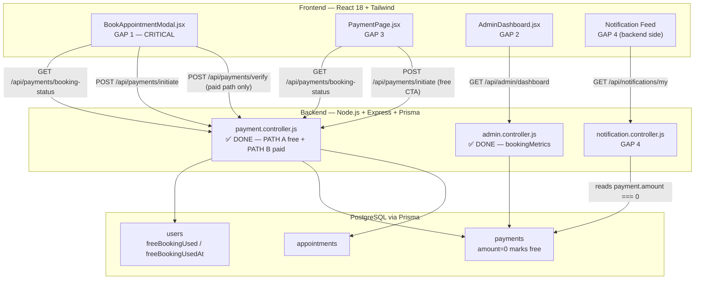
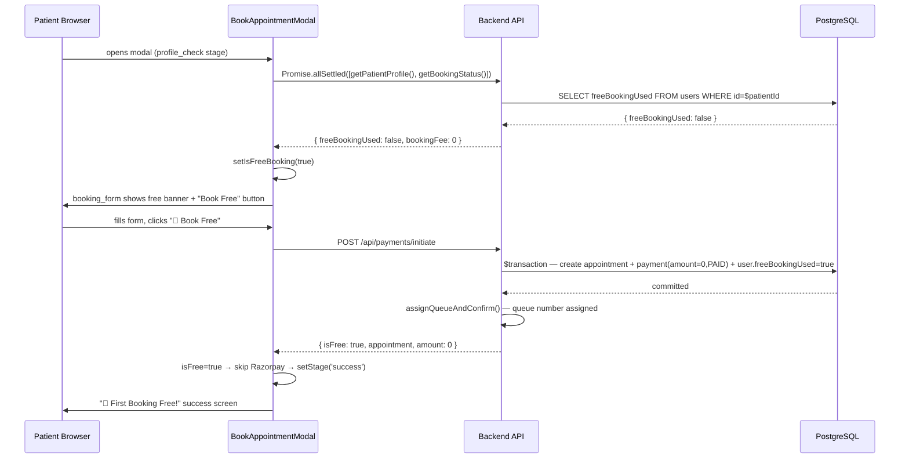
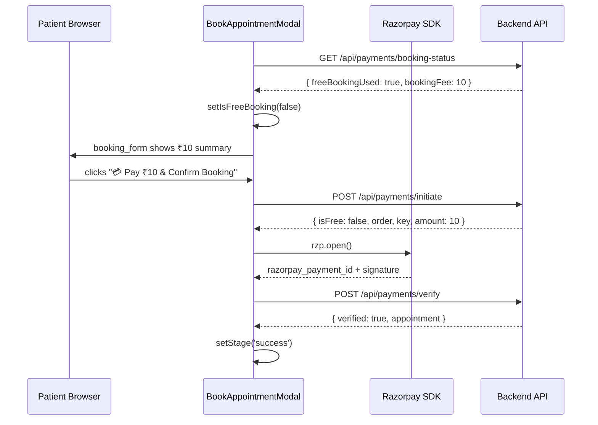

# Design Document: First Booking Free

## Overview

PulseMate Connect waives the ₹10 platform booking fee for every patient's **first appointment**. The backend is already fully implemented — the DB schema (`freeBookingUsed` / `freeBookingUsedAt` on `User`), the atomic transaction in `payment.controller.js` that creates a ₹0 payment record and sets the flag atomically, the `GET /api/payments/booking-status` endpoint, and the admin `bookingMetrics` aggregation in `getDashboard`.

This document covers the **five remaining gaps** that need to be built: (GAP 1) the `BookAppointmentModal` free-booking branch — the highest-priority change that always shows "Pay ₹10" today; (GAP 2) the `AdminDashboard` booking metrics section — the API already returns `bookingMetrics` but the frontend ignores it; (GAP 3) the `PaymentPage` free-booking state — hardcodes ₹10 and never calls `getBookingStatus`; (GAP 4) the `FREE_BOOKING_CONFIRMED` smart-feed notification in `notification.controller.js`; and (GAP 5) Jest test cases for the payment controller.

The end result is a complete user-facing feature where a new patient sees a "🎉 First Booking Free" banner, submits with zero payment, bypasses Razorpay entirely, and lands on a celebration success screen — while admins see full booking conversion metrics on the dashboard.

---

## Architecture

### System-level component diagram



### Data flow: free booking (PATH A — the new happy path)



### Data flow: paid booking (PATH B — unchanged)



### Booking flow state machine

```
[modal opens]
      │
      ▼
[profile_check] ──── getPatientProfile() + getBookingStatus() in parallel
      │
      ├── profile incomplete ──► [profile_setup] ──► [booking_form]
      │
      ▼
[booking_form]
  isFreeBooking=true  → 🎉 free banner, ₹0 summary, "🎉 Book Free" button
  isFreeBooking=false → ₹10 summary, "💳 Pay ₹10 & Confirm Booking" button
      │
      ▼ submit
      │
      ├── isFree=true ──────────────────────────────────────────────► [success]
      │   backend confirmed; queue assigned; no Razorpay              "🎉 First Booking Free!"
      │
      └── isFree=false ──► [payment] ──► Razorpay opens
                                │
                                ├── payment success ──► verify ──► [success] "✅ Confirmed"
                                ├── user dismisses ──────────────► [booking_form]
                                └── payment.failed ───────────────► [booking_form] + toast
```

---

## Components and Interfaces

### GAP 1 — `BookAppointmentModal.jsx`

**File:** `frontend/src/pages/patient/BookAppointmentModal.jsx`

**New state variables:**
```javascript
const [isFreeBooking, setIsFreeBooking] = useState(null);   // null = not yet fetched
const [bookingStatusLoaded, setBookingStatusLoaded] = useState(false);
```

**Import addition:**
```javascript
import { initiatePayment, verifyPayment, getBookingStatus } from '../../api/payment.api';
```

**`useEffect` — parallel fetch (profile + booking status):**
```javascript
useEffect(() => {
  const check = async () => {
    try {
      const [profileRes, statusRes] = await Promise.allSettled([
        getPatientProfile(),
        getBookingStatus(),
      ]);
      if (profileRes.status === 'fulfilled') {
        const user = profileRes.value.data.data.user;
        setPatientData(user);
        setStage(isProfileComplete(user) ? 'booking_form' : 'profile_setup');
      } else {
        setStage('profile_setup');
      }
      if (statusRes.status === 'fulfilled') {
        setIsFreeBooking(!statusRes.value.data.data.freeBookingUsed);
      } else {
        setIsFreeBooking(false); // fallback: treat as paid on error
      }
      setBookingStatusLoaded(true);
    } catch {
      setStage('profile_setup');
      setIsFreeBooking(false);
      setBookingStatusLoaded(true);
    }
  };
  check();
}, []);
```

**`handleProceedToPayment` — branch on `isFree`:**
```javascript
const handleProceedToPayment = async (e) => {
  e.preventDefault();
  if (!form.appointmentDate) return toast.error('Please select a date');
  setIsProcessing(true);
  try {
    const res = await initiatePayment({ doctorId: doctor.id, clinicId: clinic.id, ...form });
    const data = res.data.data;

    // ── FREE PATH ─────────────────────────────────────────────────
    if (data.isFree) {
      setStage('success');
      setTimeout(() => onSuccess(data.appointment), 2000);
      return;
    }

    // ── PAID PATH (existing logic) ─────────────────────────────────
    const { appointmentId, order, key, devMode } = data;
    if (devMode) {
      setStage('payment');
      await handleVerify({ appointmentId, razorpayOrderId: order.id,
        razorpayPaymentId: `pay_dev_${Date.now()}`, razorpaySignature: 'dev_sig' });
      return;
    }
    // ... loadRazorpay + rzp.open() (unchanged)
  } catch (err) {
    toast.error(err.response?.data?.message || 'Failed to initiate booking');
    setIsProcessing(false);
  }
};
```

**Conditional payment summary in `booking_form`:**
```jsx
{isFreeBooking ? (
  <div className="bg-emerald-50 border border-emerald-200 rounded-xl p-4 space-y-2">
    <p className="text-xs font-semibold text-emerald-600 uppercase tracking-wide mb-3">
      🎉 First Booking Free!
    </p>
    <div className="flex justify-between text-sm">
      <span className="text-gray-500">Platform Booking Fee</span>
      <span className="line-through text-gray-400">₹10</span>
    </div>
    <div className="flex justify-between text-sm font-bold text-emerald-700">
      <span>You Pay Now</span>
      <span>₹0</span>
    </div>
    <p className="text-xs text-emerald-600 mt-1">Your first booking is on us.</p>
  </div>
) : (
  /* existing ₹10 summary block — unchanged */
)}
```

**Submit button label:**
```jsx
{isProcessing ? <LoadingSpinner size="sm" /> : isFreeBooking ? '🎉 Book Free' : '💳 Pay ₹10 & Confirm Booking'}
```

**Success stage variant:**
```jsx
<div className={`w-20 h-20 ${isFreeBooking ? 'bg-emerald-100' : 'bg-green-100'} rounded-full ...`}>
  <span className="text-4xl">{isFreeBooking ? '🎉' : '✅'}</span>
</div>
<h2>{isFreeBooking ? 'First Booking Free!' : 'Booking Confirmed!'}</h2>
<p>{isFreeBooking ? 'Your first appointment is on us.' : 'Payment successful.'}</p>
```

---

### GAP 2 — `AdminDashboard.jsx`

**File:** `frontend/src/pages/admin/AdminDashboard.jsx`

**New state:**
```javascript
const [bookingMetrics, setBookingMetrics] = useState(null);
```

**`useEffect` fix:**
```javascript
// BEFORE
setStats(res.data.data.stats);

// AFTER
setStats(res.data.data.stats);
setBookingMetrics(res.data.data.bookingMetrics);
```

**New icon components (inside `StatIcon` object):**
```jsx
Gift: () => (/* gift SVG */),
CreditCard: () => (/* credit card SVG */),
TrendingUp: () => (/* trending-up SVG */),
Currency: () => (/* currency/rupee SVG */),
```

**New color schemes (inside `StatCard`'s `schemes` map):**
```javascript
emerald: { bg: 'bg-emerald-50', icon: 'text-emerald-600', accent: 'bg-emerald-500' },
violet:  { bg: 'bg-violet-50',  icon: 'text-violet-600',  accent: 'bg-violet-500'  },
amber:   { bg: 'bg-amber-50',   icon: 'text-amber-600',   accent: 'bg-amber-500'   },
cyan:    { bg: 'bg-cyan-50',    icon: 'text-cyan-600',    accent: 'bg-cyan-500'    },
```

**New "Booking Metrics" JSX section — inserted after existing stat rows, before Quick Actions:**
```jsx
<div className="mb-3">
  <SectionLabel>Booking Metrics</SectionLabel>
</div>
<div className="grid grid-cols-2 sm:grid-cols-2 lg:grid-cols-4 gap-4 mb-10">
  <StatCard label="Free Bookings"   value={bookingMetrics?.freeBookings}
    icon={StatIcon.Gift}       colorScheme="emerald" loading={isLoading} />
  <StatCard label="Paid Bookings"   value={bookingMetrics?.paidBookings}
    icon={StatIcon.CreditCard} colorScheme="violet"  loading={isLoading} />
  <StatCard label="Conversion Rate"
    value={bookingMetrics?.conversionRate != null ? `${bookingMetrics.conversionRate}%` : undefined}
    icon={StatIcon.TrendingUp} colorScheme="amber"   loading={isLoading} />
  <StatCard label="Total Revenue"
    value={bookingMetrics?.totalRevenue != null ? `₹${bookingMetrics.totalRevenue}` : undefined}
    icon={StatIcon.Currency}   colorScheme="cyan"    loading={isLoading} />
</div>
```

---

### GAP 3 — `PaymentPage.jsx`

**File:** `frontend/src/pages/patient/PaymentPage.jsx`

**New state:**
```javascript
const [isFreeBooking, setIsFreeBooking] = useState(false);
```

**Import addition:**
```javascript
import { initiatePayment, verifyPayment, getPaymentStatus, getBookingStatus } from '../../api/payment.api';
```

**`useEffect` update — add `getBookingStatus()` in parallel:**
```javascript
const [apptRes, payRes, statusRes] = await Promise.all([
  getAppointmentDetails(appointmentId),
  getPaymentStatus(appointmentId),
  getBookingStatus(),
]);
setAppointment(apptRes.data.data.appointment);
setPayment(payRes.data.data.payment);
setIsFreeBooking(!statusRes.data.data.freeBookingUsed);
```

**Free booking banner (above payment summary):**
```jsx
{isFreeBooking && !isPaid && (
  <div className="rounded-2xl bg-emerald-50 border border-emerald-200 p-4 mb-6 flex items-center gap-3">
    <span className="text-2xl">🎉</span>
    <div>
      <p className="font-semibold text-emerald-800 text-sm">First Booking Free!</p>
      <p className="text-xs text-emerald-700 mt-0.5">
        No payment required — your first appointment is on us.
      </p>
    </div>
  </div>
)}
```

**Conditional CTA:**
```jsx
{isPaid ? (
  /* existing paid confirmation — unchanged */
) : isFreeBooking ? (
  <button onClick={handleClaimFreeBooking} disabled={isPaying}
    className="btn-primary w-full py-4 text-base font-semibold bg-emerald-600 hover:bg-emerald-700">
    {isPaying ? <LoadingSpinner size="sm" /> : '🎉 Claim Free Booking'}
  </button>
) : (
  /* existing Razorpay button — unchanged */
)}
```

**`handleClaimFreeBooking`:**
```javascript
const handleClaimFreeBooking = async () => {
  setIsPaying(true);
  try {
    const res = await initiatePayment({
      doctorId: appointment.doctorId, clinicId: appointment.clinicId,
      appointmentType: appointment.appointmentType,
      appointmentDate: appointment.appointmentDate,
      slotTime: appointment.slotTime, symptoms: appointment.symptoms,
    });
    const data = res.data.data;
    if (data.isFree) {
      toast.success('🎉 First booking confirmed for free!');
      navigate('/patient/appointments');
    } else {
      // Race condition: benefit consumed on another device; fall back to paid
      setIsFreeBooking(false);
      toast('Booking fee applies. Please complete payment.', { icon: 'ℹ️' });
    }
  } catch (err) {
    toast.error(err.response?.data?.message || 'Failed to confirm booking');
  } finally {
    setIsPaying(false);
  }
};
```

---

### GAP 4 — `notification.controller.js`

**File:** `backend/src/controllers/notification.controller.js`

**`getMyNotifications` change 1 — include `payment` in `todayAppts` query:**
```javascript
prisma.appointment.findMany({
  where: { /* unchanged */ },
  include: {
    doctor: { include: { user: { select: { name: true } } } },
    clinic: { select: { name: true } },
    queueItem: true,
    payment: { select: { amount: true } },  // NEW
  },
  orderBy: { appointmentDate: 'asc' },
})
```

**`getMyNotifications` change 2 — emit `FREE_BOOKING_CONFIRMED` when `payment.amount === 0`:**
```javascript
// Inside todayAppts loop, after the existing 'confirmed_${appt.id}' push:
if (appt.payment?.amount === 0) {
  const freeId = `free_confirmed_${appt.id}`;
  notifications.push({
    id: freeId,
    type: 'FREE_BOOKING_CONFIRMED',
    category: 'Appointments',
    title: '🎉 First booking free!',
    body: `Your appointment with Dr. ${docName} is confirmed.`,
    sub: `First booking is on us · ${clinic}`,
    time: new Date(appt.createdAt || now),
    read: readSet.has(freeId),
    icon: 'gift',
    color: '#10B981',
    bg: '#ECFDF5',
    apptId: appt.id,
  });
}
```

**`markAllNotificationsRead` change** — also enumerate `free_confirmed_${appt.id}` IDs (requires the same `payment` include on the inner query to identify free appointments):
```javascript
// Inside the todayAppts loop in markAllNotificationsRead:
if (appt.payment?.amount === 0) ids.push(`free_confirmed_${appt.id}`);
```

---

### GAP 5 — Jest unit tests

**File:** `backend/src/__tests__/unit/payment.test.js` (extend existing)

The existing file covers: doctor not at clinic (400), duplicate booking (409), dev mode paid flow, verifyPayment not found (404), verifyPayment already paid (409), verifyPayment dev mode confirm.

**New test blocks to add:**

**Block A — Free first booking (PATH A):**
```javascript
describe('initiatePayment — free first booking (PATH A)', () => {
  test('returns isFree=true, amount=0 for freeBookingUsed=false user', async () => {
    // Setup: doctorClinic found, no duplicate, user.freeBookingUsed=false
    // Mock $transaction to call the callback with a tx object
    // Inside tx: re-read returns freeBookingUsed=false, appointment created, payment created, user updated
    // Post-transaction: queue assigned, appointment.update returns BOOKED with queueNumber
    // Assert: res.statusCode=200, data.isFree=true, data.amount=0
  });
});
```

**Block B — Second booking paid (PATH B):**
```javascript
describe('initiatePayment — second booking paid (PATH B)', () => {
  test('returns isFree=false, amount=10 for freeBookingUsed=true user', async () => {
    // Setup: user.freeBookingUsed=true, dev mode (no RAZORPAY_KEY_ID)
    // Assert: res.statusCode=200, data.isFree=false, data.amount=10, data.order.id matches /^order_dev_/
  });
});
```

**Block C — Race condition:**
```javascript
describe('initiatePayment — race condition', () => {
  test('retries as paid when FREE_BOOKING_ALREADY_USED thrown inside transaction', async () => {
    // Setup: outer user read returns freeBookingUsed=false (triggers PATH A)
    // $transaction mock: throws new Error('FREE_BOOKING_ALREADY_USED')
    // Second outer user read (retry): freeBookingUsed=true → falls through to PATH B
    // appointment.create + payment.create succeed for paid path
    // Assert: res.statusCode=200, data.isFree=false, data.amount=10
  });
});
```

**Block D — Cancelled free booking still consumes benefit:**
```javascript
describe('initiatePayment — cancelled free booking', () => {
  test('does not grant a second free booking after cancellation', async () => {
    // Design invariant: freeBookingUsed is never reset, even after appointment cancellation
    // Setup: user.freeBookingUsed=true (was set when first booking was made, then cancelled)
    // Assert: PATH B is taken, isFree=false, amount=10
  });
});
```

**Block E — Admin metrics aggregation:**
```javascript
describe('getDashboard — booking metrics', () => {
  test('computes conversionRate as paidBookings / totalBookings * 100 (rounded)', async () => {
    // Setup: payment.count returns 25 free + 75 paid, aggregate returns { _sum: { amount: 750 } }
    // Assert: conversionRate=75, totalRevenue=750, revenuePerPatient=10
  });

  test('conversionRate is 0 when there are no bookings', async () => {
    // Setup: both payment.count mocks return 0, aggregate returns { _sum: { amount: null } }
    // Assert: conversionRate=0, totalRevenue=0, revenuePerPatient=0
  });
});
```

---

## Data Models

### User model (DB — already exists, no changes needed)

```typescript
model User {
  id                String    @id @default(uuid())
  // ... other fields ...
  freeBookingUsed   Boolean   @default(false)   // ← benefit tracking field
  freeBookingUsedAt DateTime?                   // ← when benefit was consumed
}
```

**Invariants:**
- `freeBookingUsed` starts `false` for all users
- Transitions only `false → true` — never reversed
- When `true`, all future calls to `initiatePayment` take PATH B (₹10)

### Payment model (DB — already exists, free booking convention)

```typescript
model Payment {
  id                String  @id @default(uuid())
  appointmentId     String  @unique
  patientId         String
  amount            Float                      // 0 for free bookings, 10 for paid
  status            PaymentStatus @default(PENDING)
  method            PaymentMethod @default(RAZORPAY)
  razorpayOrderId   String?                    // 'free_<appointmentId>' for free bookings
  razorpayPaymentId String?                    // 'free_<appointmentId>' for free bookings
  razorpaySignature String?                    // 'free_booking' literal
  paidAt            DateTime?
}
```

**Free booking identification:**
- `amount === 0` AND `razorpayOrderId.startsWith('free_')` → free booking record
- Used by: `requestRefund` (skips Razorpay), `notification.controller` (GAP 4), `PaymentPage` (GAP 3)

### Booking status response shape

```typescript
interface BookingStatusResponse {
  freeBookingUsed: boolean;       // has the patient consumed their free booking?
  freeBookingUsedAt: string | null; // ISO timestamp, null if not yet used
  bookingFee: number;             // 0 if free available, 10 otherwise
}
```

### Initiate payment response shape

```typescript
// Free booking (PATH A)
interface FreeBookingResponse {
  isFree: true;
  appointmentId: string;
  appointment: Appointment;       // fully confirmed, status='BOOKED', queueNumber set
  amount: 0;
  message: string;
}

// Paid booking (PATH B)
interface PaidBookingResponse {
  isFree: false;
  appointmentId: string;
  order: RazorpayOrder;           // { id, amount (in paise), currency }
  key: string;                    // Razorpay key_id
  amount: 10;                     // ₹10 in rupees
  currency: 'INR';
  devMode: boolean;
  doctorName: string;
}
```

### Admin booking metrics shape (already returned by getDashboard)

```typescript
interface BookingMetrics {
  freeBookings: number;           // count(payments WHERE amount=0 AND status=PAID)
  paidBookings: number;           // count(payments WHERE amount>0 AND status=PAID)
  totalBookings: number;          // freeBookings + paidBookings
  conversionRate: number;         // Math.round(paidBookings / totalBookings * 100)
  totalRevenue: number;           // sum(amount) WHERE amount>0 AND status=PAID (in ₹)
  revenuePerPatient: number;      // totalRevenue / paidBookings (rounded to 2dp)
}
```

---

## Correctness Properties

These invariants must hold system-wide. They are verified by the GAP 5 Jest test suite.

### Property 1: One-time benefit per user

**Validates: Requirements 1.1**

For any patient, the number of free payment records can never exceed one.

```
∀ user u: count(payments WHERE patientId=u.id AND amount=0 AND status=PAID) ≤ 1
```

Enforced by: `$transaction` re-read inside `payment.controller.js`. The inner re-read detects concurrent claims before the DB write commits.

### Property 2: Monotonic flag — never unset

**Validates: Requirements 1.2**

The `freeBookingUsed` boolean transitions only `false → true`. No reversal is possible.

```
∀ user u: freeBookingUsed ∈ {false, true} and once set to true, stays true
```

No code path calls `user.update({ data: { freeBookingUsed: false } })`.

### Property 3: Backend is authoritative — client cannot force free

**Validates: Requirements 1.3**

The `isFreeBooking` state in React is for UI display only. The server independently checks `freeBookingUsed`.

```
∀ POST /payments/initiate: response.isFree === true ↔ user.freeBookingUsed was false inside the transaction
```

### Property 4: Free payment records are identifiable by two markers

**Validates: Requirements 1.4**

```
∀ payment p: p.amount === 0 ↔ p.razorpayOrderId.startsWith('free_')
```

### Property 5: Cancelled free booking does not restore benefit

**Validates: Requirements 1.5**

The `requestRefund` handler cancels the appointment but does not reset `freeBookingUsed`. Design-intentional anti-abuse.

```
∀ appointment a: a.status === 'CANCELLED' AND a.payment.amount === 0 ⟹ user.freeBookingUsed remains true
```

### Property 6: Conversion rate is mathematically bounded

**Validates: Requirements 2.1**

```
conversionRate = round(paidBookings / (freeBookings + paidBookings) * 100)
if (freeBookings + paidBookings) === 0 then conversionRate = 0
conversionRate ∈ [0, 100]
```

### Property 7: bookingFee derives deterministically from freeBookingUsed

**Validates: Requirements 1.1**

The frontend must use the `bookingFee` field from the API response — never hardcode ₹10.

```
bookingFee = freeBookingUsed ? 10 : 0
```

### Property 8: Race condition resolved without double-free

**Validates: Requirements 1.3**

Given N concurrent `POST /initiate` requests for the same `patientId`, exactly one receives `isFree: true`.

```
count(responses WHERE isFree=true) === 1
count(responses WHERE isFree=false) === N - 1
```

### Property 9: FREE_BOOKING_CONFIRMED notification is emitted exactly once per free appointment

**Validates: Requirements 4.1**

```
∀ appointment a WHERE a.payment.amount === 0:
  getMyNotifications returns exactly one notification with
  type='FREE_BOOKING_CONFIRMED' and apptId=a.id
```

---

## Error Handling

**E1 — `getBookingStatus` network error in `BookAppointmentModal` / `PaymentPage`**

Condition: `GET /api/payments/booking-status` rejects (5xx, network offline, 401).

Response: `isFreeBooking` defaults to `false`. The booking form shows the ₹10 flow. When `POST /initiate` fires, PATH A logic on the backend will still execute correctly if the user is actually eligible — so the server corrects the client. Worst case: user sees ₹10 but backend returns `isFree: true`, and the modal jumps directly to the success screen regardless.

No toast shown on status-fetch failure — a silent fallback is preferred to alarmist error messages before the user has even filled the form.

**E2 — Race condition: `FREE_BOOKING_ALREADY_USED` inside `$transaction`**

Condition: Two concurrent `POST /initiate` for the same patient both see `freeBookingUsed=false` before the transaction commits.

Response: The losing request catches `FREE_BOOKING_ALREADY_USED` in `initiatePayment`, sets `req.body._forcePaid = true`, and recurses once. The second call reads `freeBookingUsed=true` and takes PATH B. One recursion maximum — safe.

**E3 — `assignQueueAndConfirm` fails after transaction commits (PATH A)**

Condition: The DB transaction (appointment + payment + user flag update) commits successfully, but the subsequent queue-creation write fails.

Response: Patient's appointment remains in `PENDING_PAYMENT` status (no queue number). The `freeBookingUsed=true` flag is already set. This requires admin intervention. Logged as an error. Out of scope for v1 automated recovery, but must be monitored.

**E4 — `PaymentPage` race: free benefit consumed between page load and button click**

Condition: Patient opens `PaymentPage` on Device A (sees free CTA), simultaneously another session on Device B consumes the benefit, then Device A clicks "Claim Free Booking".

Response: `handleClaimFreeBooking` receives `isFree: false` from the server. The handler calls `setIsFreeBooking(false)`, which swaps the banner back to the ₹10 paid CTA with an info toast: "Booking fee applies. Please complete payment." No page reload required.

**E5 — Unauthenticated request to `getBookingStatus`**

Condition: Expired or missing JWT.

Response: API returns 401. The `Promise.allSettled` in the modal's `useEffect` catches the rejection, defaults `isFreeBooking=false`, and continues showing the paid flow. The booking submission will also fail with 401, prompting the app's global auth handler to redirect to login.

---

## Testing Strategy

### Unit tests — `backend/src/__tests__/unit/payment.test.js`

Tests use `node-mocks-http` for HTTP mocking and the global `prismaMock` from `setup.js`. Prisma's `$transaction` requires a separate mock because `setup.js` does not mock it — tests that exercise PATH A must add `global.prismaMock.$transaction = jest.fn(async (fn) => fn(txMock))`.

| ID | Scenario | Key assertions |
|----|----------|----------------|
| T1 | First booking free — PATH A | `isFree=true`, `amount=0`, appointment BOOKED |
| T2 | Second booking paid — PATH B dev mode | `isFree=false`, `amount=10`, `order.id` matches `/^order_dev_/` |
| T3 | Race condition — tx throws FREE_BOOKING_ALREADY_USED | Falls through to PATH B, `isFree=false` |
| T4 | Cancelled free booking re-booking | `freeBookingUsed=true` → PATH B always |
| T5 | Admin metrics — 25 free + 75 paid | `conversionRate=75`, `totalRevenue=750`, `revenuePerPatient=10` |
| T6 | Admin metrics — zero bookings | `conversionRate=0`, `totalRevenue=0`, `revenuePerPatient=0` |
| T7 | Duplicate booking guard (existing) | 409 response |
| T8 | Doctor not at clinic (existing) | 400 response |
| T9 | `verifyPayment` dev mode (existing) | `verified=true` |
| T10 | `verifyPayment` already PAID (existing) | 409 response |

**Run command:**
```bash
npx jest --testPathPattern=payment --projects unit-and-integration
```

### Frontend integration (manual / Playwright scope)

| ID | Scenario | Expected |
|----|----------|----------|
| F1 | New patient opens `BookAppointmentModal` | Green "🎉 First Booking Free" banner, ₹0 total, button label "🎉 Book Free" |
| F2 | Free booking confirmed | No Razorpay popup; success screen shows "🎉 First Booking Free!" |
| F3 | Same patient opens modal again | ₹10 summary, "💳 Pay ₹10 & Confirm Booking" button |
| F4 | Admin loads dashboard | "Booking Metrics" section visible with all 4 stat cards |
| F5 | Patient opens `PaymentPage` (free eligible) | Free booking banner + "Claim Free Booking" CTA |
| F6 | Patient opens notification feed (free eligible) | `FREE_BOOKING_CONFIRMED` notification appears after booking |

---

## Performance Considerations

- `GET /api/payments/booking-status` is a single-row PK lookup on `users.id` — O(1). The existing index on `id` covers this.
- `BookAppointmentModal` calls `getPatientProfile` and `getBookingStatus` concurrently via `Promise.allSettled`. No latency added vs. the current sequential fetch.
- `AdminDashboard` already issues 12 parallel Prisma queries on load. `bookingMetrics` is part of the same `Promise.all` in `getDashboard` — zero additional round trips.
- The GAP 4 notification change adds `payment: { select: { amount: true } }` to the `todayAppts` include — a single FK JOIN on a unique column. Negligible cost.

---

## Security Considerations

- **Backend is authoritative:** The `isFreeBooking` flag in React is display-only. A tampered client cannot force a free booking — the server independently reads `user.freeBookingUsed` inside a DB transaction.
- **Anti-abuse (v1):** Benefit is tied to `User.id`. The `mobile` field is `@unique` and requires OTP verification — creating throwaway accounts to re-use the benefit is not practical.
- **Concurrency:** The `$transaction` with re-read pattern ensures exactly-once semantics at the database level under any concurrency level.
- **Free payment marker:** `razorpayOrderId = 'free_<appointmentId>'` makes free records instantly identifiable, preventing any Razorpay HMAC verification from being accidentally invoked on them in `verifyPayment`.
- **Benefit non-restoration:** Even if a patient cancels their free appointment, `freeBookingUsed` is never reset. This is documented and intentional.

---

## Dependencies

| Dependency | Purpose | Status |
|------------|---------|--------|
| `prisma` — `User.freeBookingUsed` | DB tracking field | ✅ Migration applied |
| `react-hot-toast` | Toast notifications in modal/page | ✅ Installed |
| `getBookingStatus` in `payment.api.js` | Frontend API wrapper | ✅ Already exported |
| `node-mocks-http` | Jest HTTP mocking | ✅ Installed |
| Razorpay Web SDK | Payment gateway — paid path only (unchanged) | ✅ Loaded dynamically |
| Firebase FCM | Push notifications — free booking message (✅ backend done) | ✅ Configured |

No new npm packages are required for any of the five gaps.

---

## Rollout Plan

**Phase 1 — GAP 4: `notification.controller.js`** (lowest risk, backend-only, additive)
Add `payment: { select: { amount: true } }` to `todayAppts` include and push `FREE_BOOKING_CONFIRMED` notifications. No frontend change. Can be deployed independently.

**Phase 2 — GAP 2: `AdminDashboard.jsx`** (admin-only UI, isolated)
Wire `bookingMetrics` state and render 4 new stat cards. Zero patient-facing risk.

**Phase 3 — GAP 3: `PaymentPage.jsx`** (lower traffic than modal)
Add free booking detection to the standalone payment page before tackling the modal. Lower blast radius for testing.

**Phase 4 — GAP 1: `BookAppointmentModal.jsx`** (highest impact, highest traffic)
The main booking surface. Update state, parallel fetch, branching logic, conditional UI. Requires the most QA attention.

**Phase 5 — GAP 5: Jest tests** (run before merging each phase)
```bash
npx jest --testPathPattern=payment --projects unit-and-integration
```

---

## Risk Analysis

| Risk | Likelihood | Impact | Mitigation |
|------|-----------|--------|------------|
| Frontend fallback to paid when status API fails | Low | Low — server corrects on submit | Silent fallback to paid; backend PATH A fires correctly regardless |
| Race condition on concurrent booking | Very Low | Medium | DB `$transaction` re-read prevents double-free |
| `freeBookingUsed` inadvertently reset | None | High | No code path resets it; `resetDatabase` recreates users with default `false` |
| Admin dashboard crash if `bookingMetrics` missing | Low | Low | Optional chaining `bookingMetrics?.freeBookings` prevents crashes |
| PaymentPage race between page load and button click | Very Low | Low | `handleClaimFreeBooking` handles `isFree: false` gracefully |
| `assignQueueAndConfirm` fails post-transaction | Very Low | Medium | Log + admin manual recovery; monitor in Phase 4 rollout |
| Account re-creation abuse (delete account, re-register) | Medium | Medium | Phase 2 future work — AbuseGuard table; acceptable for MVP |
