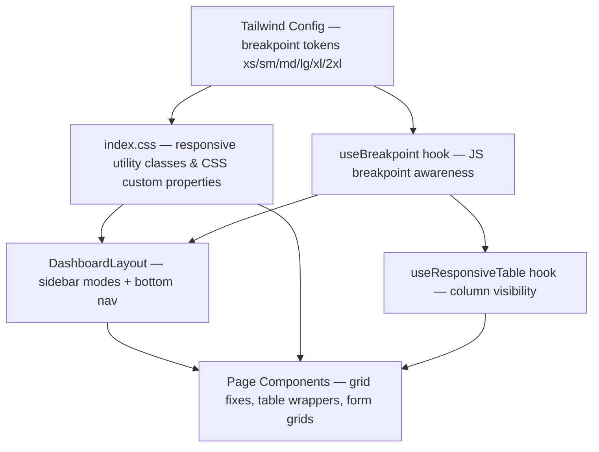
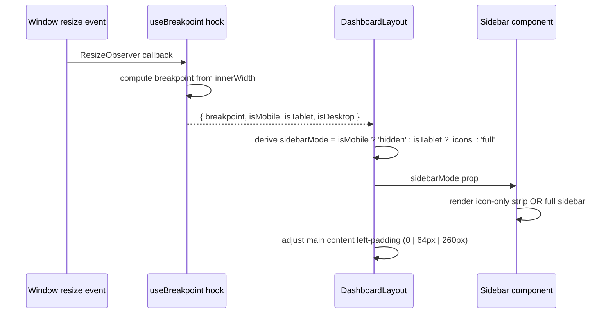
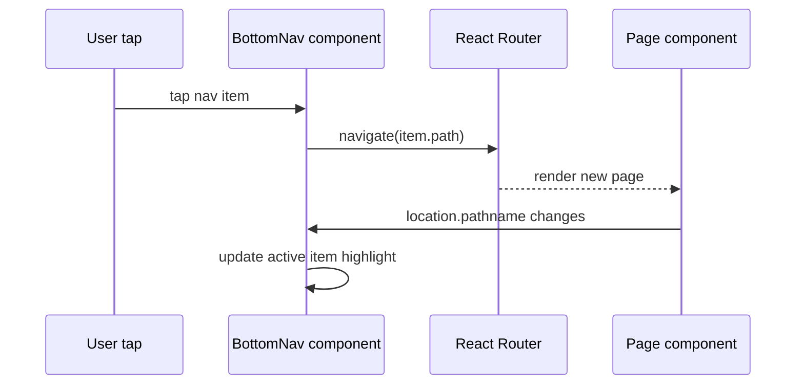

# Design Document: Full Responsive Design System — PulseMate Web Frontend

## Overview

PulseMate is a multi-role healthcare platform (React 18 + Vite, TailwindCSS, React Router v6) serving five distinct user roles: PATIENT, DOCTOR, RECEPTIONIST, CLINIC_OWNER, and SUPER_ADMIN. The current frontend has a solid desktop layout but suffers from a missing tablet breakpoint (768–1023 px), small touch targets on mobile, unscolled data tables on narrow screens, inconsistent grid patterns across pages, and no bottom navigation for the mobile-first PATIENT role.

This design specifies a production-grade responsive system that is **100% backward-compatible**. No existing component APIs change, no routes change, no CSS class names are removed. Every addition is purely additive: new Tailwind utility classes, two new React hooks, one new CSS layer block, and targeted breakpoint fixes on existing pages. The result covers the full viewport range from 320 px (xs mobile) through 1536 px (2xl desktop).

---

## Architecture

The system is layered into four concerns that interact but stay decoupled:



### Viewport Tiers

| Tier | Width Range | Tailwind Prefix | Sidebar State | Navigation |
|------|------------|-----------------|---------------|------------|
| xs   | 320–479 px  | (default)       | Hidden        | Bottom nav bar |
| sm   | 480–639 px  | `sm:`           | Hidden        | Bottom nav bar |
| md   | 640–767 px  | `md:`           | Hidden        | Bottom nav bar |
| tablet | 768–1023 px | `lg:` (existing) → new `tb:` via plugin-free trick | Icon-only (64 px) | Top bar only |
| desktop | 1024–1279 px | `lg:` | Full (260 px) | Sidebar |
| xl   | 1280–1535 px | `xl:` | Full (260 px) | Sidebar |
| 2xl  | 1536 px+    | `2xl:` | Full (260 px) | Sidebar |

> **Implementation note:** Rather than adding a custom plugin, the tablet sidebar uses a dedicated CSS class `.sidebar-collapsed` toggled by the `useBreakpoint` hook, keeping the Tailwind config change minimal. The existing `lg:` breakpoint (1024 px) retains its meaning everywhere.

---

## Sequence Diagrams

### Breakpoint-Driven Sidebar Mode Switch



### Mobile Bottom Navigation Tap



---

## Components and Interfaces

### Component 1: `useBreakpoint` hook

**File:** `frontend/src/hooks/useBreakpoint.js`

**Purpose:** Single source of truth for viewport width in JS. Uses `ResizeObserver` on `document.documentElement` (debounced 50 ms) to avoid layout thrashing. Returns a stable object reference that only changes identity when the breakpoint tier changes.

**Interface:**
```typescript
type Breakpoint = 'xs' | 'sm' | 'md' | 'tablet' | 'lg' | 'xl' | '2xl'

interface BreakpointState {
  breakpoint: Breakpoint   // current named tier
  width: number            // raw innerWidth px
  isMobile: boolean        // width < 768
  isTablet: boolean        // 768 <= width < 1024
  isDesktop: boolean       // width >= 1024
  isAtLeast: (bp: Breakpoint) => boolean
}

function useBreakpoint(): BreakpointState
```

**Responsibilities:**
- Subscribe to `window.innerWidth` changes via `ResizeObserver` with 50 ms debounce
- Map raw width to named tier using the breakpoint map from `tailwind.config.cjs`
- Expose boolean shorthands `isMobile`, `isTablet`, `isDesktop` for the most common uses
- Clean up observer on unmount
- Return stable object reference (no re-render if tier unchanged)

---

### Component 2: `useResponsiveTable` hook

**File:** `frontend/src/hooks/useResponsiveTable.js`

**Purpose:** Drives column visibility in data tables without requiring each table to re-implement breakpoint logic.

**Interface:**
```typescript
interface ColumnConfig {
  key: string
  label: string
  hideBelow?: Breakpoint   // hide this column when viewport < this breakpoint
  priority: number         // 1 = always visible, higher = hidden first
}

interface ResponsiveTableState {
  visibleColumns: ColumnConfig[]
  hiddenColumns: ColumnConfig[]
  isMobileView: boolean
}

function useResponsiveTable(columns: ColumnConfig[]): ResponsiveTableState
```

**Responsibilities:**
- Consume `useBreakpoint` internally
- Filter `columns` array based on `hideBelow` and current breakpoint
- Return derived arrays — no state mutations

---

### Component 3: Updated `DashboardLayout`

**File:** `frontend/src/layouts/DashboardLayout.jsx` (modified, backward-compatible)

**Purpose:** Orchestrates the three-mode sidebar (hidden / icon-only / full) and conditionally renders the bottom navigation bar for mobile.

**Interface:** (existing prop API unchanged)
```typescript
interface DashboardLayoutProps {
  children: React.ReactNode   // unchanged
}
```

**Sidebar Modes:**
```typescript
type SidebarMode = 'hidden' | 'icons' | 'full'
```

**Responsibilities:**
- Use `useBreakpoint` to derive `sidebarMode`
- In `'icons'` mode: render 64 px wide sidebar strip showing only icons with tooltip on hover
- In `'full'` mode: render existing 260 px sidebar (no change to existing markup)
- In `'hidden'` mode: render mobile drawer (existing behavior, no change)
- Render `<BottomNav>` only when `isMobile === true`
- Add `pb-safe-bottom` padding to `<main>` when bottom nav is visible to avoid content hidden behind it
- Apply dynamic `lg:pl-[260px]` vs `lg:pl-[64px]` based on `sidebarMode`

---

### Component 4: `BottomNav`

**File:** `frontend/src/components/navigation/BottomNav.jsx` (new)

**Purpose:** Fixed bottom navigation bar for mobile users. Shows role-specific top-4 nav items with icon + label. Visible only below 768 px.

**Interface:**
```typescript
interface BottomNavProps {
  navItems: NavItem[]
  currentPath: string
}

interface NavItem {
  path: string
  label: string
  icon: React.ComponentType
}
```

**Responsibilities:**
- Render fixed bottom bar with `env(safe-area-inset-bottom)` padding (iPhone notch support)
- Show max 5 items (trimmed from role nav items); overflow items remain accessible via sidebar drawer
- Highlight active item using `location.pathname` matching (same `isActive()` logic as sidebar)
- Touch targets minimum 44×44 px per WCAG 2.5.5
- Backdrop blur + semi-transparent background (matches existing `.mobile-fixed-bar` CSS)

---

### Component 5: `ResponsiveTableWrapper`

**File:** `frontend/src/components/ui/ResponsiveTableWrapper.jsx` (new)

**Purpose:** Wraps any `<table>` with horizontal scroll on mobile and provides accessible overflow cues.

**Interface:**
```typescript
interface ResponsiveTableWrapperProps {
  children: React.ReactNode   // must be a <table> element
  className?: string
}
```

**Responsibilities:**
- Apply `overflow-x-auto -mx-4 sm:mx-0` scroll container
- Apply `min-w-[640px]` to the inner table to trigger horizontal scroll below 640 px
- Visually indicate scroll availability with a fade gradient on right edge on mobile

---

## Data Models

### Breakpoint Map (source of truth)

```typescript
const BREAKPOINTS: Record<string, number> = {
  xs:     0,
  sm:     480,
  md:     640,
  tablet: 768,
  lg:     1024,
  xl:     1280,
  '2xl':  1536,
}
```

This map is consumed by both `tailwind.config.cjs` (as `screens` extension) and `useBreakpoint.js` to keep CSS and JS in sync.

### Tailwind Config Extension (additive)

```javascript
// tailwind.config.cjs — extend screens only
screens: {
  'xs': '480px',   // adds xs breakpoint (320–479 uses default/un-prefixed)
  // sm, md, lg, xl, 2xl already defined by Tailwind defaults
  // No tablet custom screen needed — handled by CSS custom property approach
}
```

### CSS Custom Properties (new, added to `:root` in `index.css`)

```css
:root {
  --sidebar-width: 260px;
  --sidebar-collapsed-width: 64px;
  --topbar-height: 56px;
  --bottom-nav-height: 64px;
  --touch-target-min: 44px;
}
```

### Responsive Grid Pattern Tokens (utility classes in `index.css`)

```css
/* Standard stat-card grids */
.grid-stats-sm   { grid-template-columns: repeat(2, 1fr); }  /* xs-md */
.grid-stats-md   { grid-template-columns: repeat(3, 1fr); }  /* md-lg */
.grid-stats-lg   { grid-template-columns: repeat(4, 1fr); }  /* lg+   */

/* Standard content grids */
.grid-cards-sm   { grid-template-columns: 1fr; }
.grid-cards-md   { grid-template-columns: repeat(2, 1fr); }
.grid-cards-lg   { grid-template-columns: repeat(3, 1fr); }
```

---

## Algorithmic Pseudocode

### Algorithm 1: `useBreakpoint` — Compute Tier from Width

```pascal
ALGORITHM computeBreakpointTier(width)
INPUT:  width — integer, viewport width in pixels
OUTPUT: tier  — string, one of 'xs'|'sm'|'md'|'tablet'|'lg'|'xl'|'2xl'

BEGIN
  IF width < 480 THEN
    RETURN 'xs'
  ELSE IF width < 640 THEN
    RETURN 'sm'
  ELSE IF width < 768 THEN
    RETURN 'md'
  ELSE IF width < 1024 THEN
    RETURN 'tablet'
  ELSE IF width < 1280 THEN
    RETURN 'lg'
  ELSE IF width < 1536 THEN
    RETURN 'xl'
  ELSE
    RETURN '2xl'
  END IF
END
```

**Preconditions:**
- `width` is a non-negative integer
- Breakpoint boundaries are immutable constants matching `tailwind.config.cjs`

**Postconditions:**
- Returns exactly one of the 7 named tiers
- Return value changes only when `width` crosses a boundary value
- No side effects

---

### Algorithm 2: `useBreakpoint` Hook — ResizeObserver with Debounce

```pascal
PROCEDURE useBreakpoint()
OUTPUT: BreakpointState (stable object reference)

BEGIN
  state ← { breakpoint: computeBreakpointTier(window.innerWidth), width: window.innerWidth }

  PROCEDURE handleResize(entries)
    newWidth ← entries[0].contentRect.width
    newTier  ← computeBreakpointTier(newWidth)

    IF newTier ≠ state.breakpoint THEN
      state ← { breakpoint: newTier, width: newWidth,
                 isMobile:  newWidth < 768,
                 isTablet:  newWidth ≥ 768 AND newWidth < 1024,
                 isDesktop: newWidth ≥ 1024 }
      triggerRerender()
    END IF
  END PROCEDURE

  debouncedResize ← debounce(handleResize, 50ms)

  observer ← new ResizeObserver(debouncedResize)
  observer.observe(document.documentElement)

  ON component unmount DO
    observer.disconnect()
  END ON

  RETURN state
END
```

**Preconditions:**
- `ResizeObserver` is available (polyfilled for older browsers if needed)
- Hook is called inside a React function component or custom hook

**Postconditions:**
- Component re-renders only when breakpoint *tier* changes, not on every pixel change
- Observer is cleaned up on unmount preventing memory leaks

**Loop Invariants:** N/A (event-driven, not loop-based)

---

### Algorithm 3: `DashboardLayout` — Sidebar Mode Derivation

```pascal
ALGORITHM deriveSidebarMode(isMobile, isTablet, isDesktop)
INPUT:  isMobile, isTablet, isDesktop — booleans
OUTPUT: mode — 'hidden' | 'icons' | 'full'

BEGIN
  IF isMobile THEN
    RETURN 'hidden'
  ELSE IF isTablet THEN
    RETURN 'icons'
  ELSE
    RETURN 'full'
  END IF
END
```

**Preconditions:**
- Exactly one of isMobile, isTablet, isDesktop is true at any time

**Postconditions:**
- Returns a valid SidebarMode string
- 'icons' mode triggers 64 px sidebar strip with icon-only nav items + tooltips
- 'full' mode renders the existing 260 px sidebar (zero change to existing markup)

---

### Algorithm 4: `useResponsiveTable` — Column Visibility Filter

```pascal
ALGORITHM filterVisibleColumns(columns, currentBreakpoint)
INPUT:  columns          — array of ColumnConfig
        currentBreakpoint — string tier
OUTPUT: visibleColumns   — array of ColumnConfig (ordered by priority)

BEGIN
  BP_ORDER ← ['xs', 'sm', 'md', 'tablet', 'lg', 'xl', '2xl']
  currentIndex ← indexOf(BP_ORDER, currentBreakpoint)

  visible ← []
  hidden  ← []

  FOR each col IN columns DO
    ASSERT col.priority ≥ 1

    IF col.hideBelow IS undefined THEN
      visible.append(col)
    ELSE
      hideIndex ← indexOf(BP_ORDER, col.hideBelow)
      IF currentIndex ≥ hideIndex THEN
        visible.append(col)
      ELSE
        hidden.append(col)
      END IF
    END IF
  END FOR

  RETURN { visibleColumns: visible, hiddenColumns: hidden }
END
```

**Preconditions:**
- `columns` array is non-empty
- Each `col.priority` ≥ 1
- `col.hideBelow`, if set, is a valid Breakpoint string

**Postconditions:**
- Every column appears in exactly one of `visibleColumns` or `hiddenColumns`
- `visibleColumns` preserves original array order
- Columns with no `hideBelow` are always visible

**Loop Invariants:**
- Each processed column is placed in exactly one output array
- `visible.length + hidden.length === columns.length` holds after every iteration

---

### Algorithm 5: Touch Target Enforcement

```pascal
PROCEDURE enforceTouchTarget(element)
INPUT: element — a button or interactive element
OUTPUT: element with minimum 44×44px clickable area

BEGIN
  // CSS approach — applied globally via index.css
  // No runtime algorithm needed; enforced at CSS layer:

  RULE "button, [role='button'], a, input[type='checkbox'], select" DO
    min-height: max(44px, intrinsic height)
    min-width:  max(44px, intrinsic width)
  END RULE

  // For elements where visual size must stay small (e.g. badge buttons),
  // use ::before pseudo-element to expand hit area without affecting layout:
  RULE ".touch-target-expand::before" DO
    content: ''
    position: absolute
    inset: -8px  // expands hit area 8px on all sides
  END RULE
END
```

**Preconditions:**
- Element is rendered in the DOM
- Parent container allows `position: relative`

**Postconditions:**
- Clickable area ≥ 44×44 px (WCAG 2.5.5 AAA target)
- Visual appearance unchanged for elements using `::before` expansion

---

## Key Functions with Formal Specifications

### Function 1: `useBreakpoint()` — React Hook

```typescript
function useBreakpoint(): BreakpointState
```

**Preconditions:**
- Called inside a React function component or custom hook
- `window` object exists (SSR guard required: `typeof window !== 'undefined'`)

**Postconditions:**
- Returns a `BreakpointState` object on every call
- `state.isMobile === (state.width < 768)`
- `state.isTablet === (state.width >= 768 && state.width < 1024)`
- `state.isDesktop === (state.width >= 1024)`
- `state.isMobile XOR state.isTablet XOR state.isDesktop` — exactly one is true
- Re-render only triggered when `state.breakpoint` tier changes

**Loop Invariants:** N/A

---

### Function 2: `useResponsiveTable(columns)` — React Hook

```typescript
function useResponsiveTable(columns: ColumnConfig[]): ResponsiveTableState
```

**Preconditions:**
- `columns` is a non-empty array with stable reference (memoized at call site)
- Each `ColumnConfig.key` is unique within the array

**Postconditions:**
- `visibleColumns.length + hiddenColumns.length === columns.length`
- No column key appears in both arrays
- `isMobileView === (currentBreakpoint.isMobile)`

---

### Function 3: `BottomNav` — React Component

```typescript
function BottomNav({ navItems, currentPath }: BottomNavProps): JSX.Element
```

**Preconditions:**
- `navItems.length` is between 1 and 5
- `currentPath` is a valid pathname string

**Postconditions:**
- Renders exactly `navItems.length` nav items
- Exactly one item has `aria-current="page"` (the active one)
- Each nav item's touch target is ≥ 44×44 px
- Component is `position: fixed` at `bottom: 0` with `z-index: 40`
- Bottom padding accounts for `env(safe-area-inset-bottom)`

---

### Function 4: `ResponsiveTableWrapper` — React Component

```typescript
function ResponsiveTableWrapper({ children, className }: ResponsiveTableWrapperProps): JSX.Element
```

**Preconditions:**
- `children` is a `<table>` element or a component that renders one
- Component is used inside a normal document flow container

**Postconditions:**
- On viewports < 640 px: `overflow-x: auto` container wraps table
- Inner table has `min-width: 640px` to trigger horizontal scroll
- On viewports ≥ 640 px: no overflow wrapper effect (renders as normal block)
- Scroll container does NOT clip vertical content

---

## Example Usage

### `useBreakpoint` hook

```typescript
// In any component that needs breakpoint awareness
import { useBreakpoint } from '../hooks/useBreakpoint'

const MyComponent = () => {
  const { isMobile, isTablet, isDesktop, breakpoint } = useBreakpoint()

  return (
    <div>
      {isMobile && <MobileView />}
      {isTablet && <TabletView />}
      {isDesktop && <DesktopView />}
    </div>
  )
}
```

### `useResponsiveTable` hook

```typescript
// In a data table component
import { useResponsiveTable } from '../hooks/useResponsiveTable'

const COLUMNS: ColumnConfig[] = [
  { key: 'name',   label: 'Patient',  priority: 1 },                      // always visible
  { key: 'status', label: 'Status',   priority: 2 },                      // always visible
  { key: 'phone',  label: 'Phone',    priority: 3, hideBelow: 'tablet' }, // hidden < 768px
  { key: 'date',   label: 'Date',     priority: 2, hideBelow: 'md' },     // hidden < 640px
  { key: 'doctor', label: 'Doctor',   priority: 3, hideBelow: 'lg' },     // hidden < 1024px
]

const PatientTable = ({ rows }) => {
  const { visibleColumns } = useResponsiveTable(COLUMNS)

  return (
    <ResponsiveTableWrapper>
      <table>
        <thead>
          <tr>
            {visibleColumns.map(col => <th key={col.key}>{col.label}</th>)}
          </tr>
        </thead>
        <tbody>
          {rows.map(row => (
            <tr key={row.id}>
              {visibleColumns.map(col => <td key={col.key}>{row[col.key]}</td>)}
            </tr>
          ))}
        </tbody>
      </table>
    </ResponsiveTableWrapper>
  )
}
```

### Updated `DashboardLayout` — icon-only sidebar mode

```typescript
// DashboardLayout.jsx — tablet sidebar strip (new addition)
const IconOnlySidebar = ({ navItems, isActive }) => (
  <aside
    className="flex flex-col h-full w-[64px] items-center py-4 gap-1"
    style={{ backgroundColor: '#1e293b' }}
    aria-label="Collapsed navigation"
  >
    {/* Logo mark only */}
    <div className="mb-4 p-2">
      <PulsemateLogo size="icon" theme="dark" />
    </div>
    <nav className="flex-1 flex flex-col gap-0.5 w-full px-2">
      {navItems.map(item => (
        <Tooltip key={item.path} content={item.label} side="right">
          <Link
            to={item.path}
            className={`w-full h-11 flex items-center justify-center rounded-xl transition-all
              ${isActive(item.path)
                ? 'bg-blue-600 text-white'
                : 'text-slate-400 hover:bg-white/10 hover:text-white'
              }`}
            aria-label={item.label}
          >
            <item.icon />
          </Link>
        </Tooltip>
      ))}
    </nav>
  </aside>
)
```

### `BottomNav` component

```typescript
// frontend/src/components/navigation/BottomNav.jsx
const BottomNav = ({ navItems, currentPath }) => {
  const items = navItems.slice(0, 5)  // max 5 items

  return (
    <nav
      className="fixed bottom-0 left-0 right-0 z-40 bg-white/92 backdrop-blur-md
                 border-t border-gray-200 flex items-center justify-around
                 px-2 pb-[env(safe-area-inset-bottom)]"
      style={{ height: 'calc(64px + env(safe-area-inset-bottom))' }}
      aria-label="Mobile navigation"
    >
      {items.map(item => {
        const active = currentPath === item.path || currentPath.startsWith(item.path + '/')
        return (
          <Link
            key={item.path}
            to={item.path}
            className={`flex flex-col items-center justify-center gap-0.5 min-w-[44px]
                        min-h-[44px] px-2 rounded-xl transition-colors
                        ${active ? 'text-blue-600' : 'text-gray-400 hover:text-gray-700'}`}
            aria-current={active ? 'page' : undefined}
          >
            <item.icon />
            <span className="text-[10px] font-medium leading-none">{item.label}</span>
          </Link>
        )
      })}
    </nav>
  )
}
```

### Page Grid Fix — `AdminDashboard` stat cards

```typescript
// Before (missing md breakpoint):
// <div className="grid grid-cols-2 sm:grid-cols-2 lg:grid-cols-4 gap-4 mb-8">

// After (complete breakpoint coverage):
// <div className="grid grid-cols-2 md:grid-cols-3 lg:grid-cols-4 gap-3 md:gap-4 mb-8">
```

### Page Grid Fix — `TodayQueue` stats

```typescript
// Before (collapses badly at xs):
// <div className="grid grid-cols-3 gap-4 mb-6">

// After (xs-safe):
// <div className="grid grid-cols-3 gap-2 sm:gap-4 mb-6">
// Each stat card adds: min-w-0 and truncate on text
```

### Responsive Typography Scale (new CSS layer)

```css
/* index.css — added to @layer base */
h1 { @apply text-xl sm:text-2xl lg:text-3xl font-bold; }
h2 { @apply text-lg sm:text-xl font-semibold; }
h3 { @apply text-base sm:text-lg font-semibold; }

/* Page-level headings use .page-title utility: */
.page-title { @apply text-xl sm:text-2xl font-bold text-gray-900 tracking-tight; }
.page-subtitle { @apply text-sm text-gray-500 mt-1; }
```

---

## Correctness Properties

These properties must hold after implementation. They are expressed as invariants that can be validated manually or via integration tests.

### Layout Invariants

1. **Sidebar exclusivity:** At any viewport width, exactly one of {bottom nav, icon sidebar, full sidebar} is visible. Never two simultaneously.
   - `isMobile → bottomNavVisible AND !sidebarVisible`
   - `isTablet → iconSidebarVisible AND !bottomNavVisible`
   - `isDesktop → fullSidebarVisible AND !bottomNavVisible`

2. **Content offset correctness:** The main content area left-padding equals the visible sidebar width at all times.
   - `isMobile → mainPaddingLeft === 0`
   - `isTablet → mainPaddingLeft === 64px (var(--sidebar-collapsed-width))`
   - `isDesktop → mainPaddingLeft === 260px (var(--sidebar-width))`

3. **Bottom nav clearance:** When bottom nav is visible, the main content area has `padding-bottom ≥ var(--bottom-nav-height) + env(safe-area-inset-bottom)` so no content is hidden behind it.

### Touch Target Invariants

4. **Minimum touch target:** ∀ interactive elements e: `clickableArea(e).height ≥ 44px AND clickableArea(e).width ≥ 44px`
   - This applies on all viewports, not just mobile

### Grid Invariants

5. **Stat grid non-overflow:** ∀ viewport width w: stat card grids never overflow their container. Specifically:
   - At w < 480px: grid has ≤ 2 columns
   - At 480 ≤ w < 1024px: grid has ≤ 3 columns
   - At w ≥ 1024px: grid may have 4 columns

6. **Table scrollability:** ∀ `<table>` wrapped in `<ResponsiveTableWrapper>`: at w < 640px, a horizontal scroll container exists and no horizontal page overflow occurs.

### Typography Invariants

7. **Heading scale monotonicity:** For any heading element, font-size is non-decreasing as viewport width increases.
   - `fontSize(xs) ≤ fontSize(sm) ≤ fontSize(lg)`

### Backward-Compatibility Invariants

8. **No removed class names:** All existing `.card`, `.btn-primary`, `.input`, `.badge`, `.page-container` class names continue to work identically.

9. **No route changes:** All existing React Router routes remain unchanged and navigable.

10. **No prop API changes:** `DashboardLayout`, `Modal`, `StatusBadge`, and all UI components retain their existing prop interfaces.

---

## Error Handling

### Scenario 1: `ResizeObserver` Not Available (legacy browser)

**Condition:** `window.ResizeObserver` is undefined  
**Response:** `useBreakpoint` falls back to `window.addEventListener('resize', handler)` with the same debounce logic  
**Recovery:** Breakpoint detection continues working; slightly less accurate entry point detection  

### Scenario 2: Breakpoint Detection During SSR / Test Environment

**Condition:** `window` is undefined (e.g. Vitest with jsdom or SSR)  
**Response:** `useBreakpoint` returns `{ breakpoint: 'lg', isMobile: false, isTablet: false, isDesktop: true }` as default (desktop-first assumption)  
**Recovery:** No error thrown; component renders in desktop mode until client hydrates  

### Scenario 3: Bottom Nav Item Count Exceeds 5

**Condition:** A role's `navItems` array has more than 5 entries  
**Response:** `BottomNav` silently renders only the first 5 items (`navItems.slice(0, 5)`). The remaining items remain accessible through the mobile sidebar drawer (hamburger).  
**Recovery:** No crash; full nav still accessible via drawer  

### Scenario 4: Table With No `hideBelow` Columns

**Condition:** All columns have `hideBelow: undefined`  
**Response:** `useResponsiveTable` returns all columns as visible on all breakpoints  
**Recovery:** Table renders normally; developer may add `hideBelow` later if needed  

### Scenario 5: Viewport Resize During Animation / Transition

**Condition:** User rapidly resizes viewport while sidebar transition is in progress  
**Response:** `useBreakpoint` debounce (50 ms) prevents redundant state updates; sidebar CSS transition (`duration-300`) completes gracefully  
**Recovery:** Final stable breakpoint state wins; no visual glitch  

---

## Testing Strategy

### Unit Testing Approach

Test file locations mirror source under `frontend/src/__tests__/`.

**`useBreakpoint.test.js`**
- Mock `window.innerWidth` at various values and verify returned `breakpoint`, `isMobile`, `isTablet`, `isDesktop` are all correct
- Test boundary values: 479, 480, 639, 640, 767, 768, 1023, 1024, 1279, 1280, 1535, 1536
- Test cleanup: verify `ResizeObserver.disconnect()` called on unmount
- Test stable reference: verify hook does not re-render when tier unchanged

**`useResponsiveTable.test.js`**
- Test `hideBelow` filtering at each breakpoint tier
- Test that columns with no `hideBelow` always appear in `visibleColumns`
- Test `visibleColumns.length + hiddenColumns.length === columns.length` invariant
- Test empty columns array edge case

**`BottomNav.test.jsx`**
- Test renders max 5 items even if given 7
- Test `aria-current="page"` on active item only
- Test that items match navItems prop

**`ResponsiveTableWrapper.test.jsx`**
- Test `overflow-x-auto` class present in output
- Test min-width style applied to inner element

### Property-Based Testing Approach

**Property Test Library:** fast-check (install: `npm install --save-dev fast-check`)

**Property 1 — Breakpoint tier completeness:** For any non-negative integer width, `computeBreakpointTier(width)` returns exactly one of the 7 valid tiers.

```typescript
// useBreakpoint.property.test.js
import * as fc from 'fast-check'
import { computeBreakpointTier } from '../hooks/useBreakpoint'

const VALID_TIERS = new Set(['xs', 'sm', 'md', 'tablet', 'lg', 'xl', '2xl'])

test('computeBreakpointTier always returns a valid tier', () => {
  fc.assert(
    fc.property(fc.nat({ max: 5000 }), (width) => {
      const tier = computeBreakpointTier(width)
      return VALID_TIERS.has(tier)
    })
  )
})
```

**Property 2 — Table column partition completeness:** For any columns array, `visibleColumns + hiddenColumns` always equals `columns`.

```typescript
test('column partition is complete and non-overlapping', () => {
  fc.assert(
    fc.property(
      fc.array(fc.record({
        key: fc.string({ minLength: 1 }),
        label: fc.string(),
        priority: fc.integer({ min: 1, max: 5 }),
        hideBelow: fc.option(fc.constantFrom('xs','sm','md','tablet','lg','xl','2xl'))
      }), { minLength: 1 }),
      fc.constantFrom('xs','sm','md','tablet','lg','xl','2xl'),
      (columns, bp) => {
        const { visibleColumns, hiddenColumns } = filterColumns(columns, bp)
        return visibleColumns.length + hiddenColumns.length === columns.length
      }
    )
  )
})
```

**Property 3 — Boolean exclusivity:** `isMobile XOR isTablet XOR isDesktop` is always true for any width.

```typescript
test('exactly one of isMobile/isTablet/isDesktop is true for any width', () => {
  fc.assert(
    fc.property(fc.nat({ max: 5000 }), (width) => {
      const state = computeBreakpointState(width)
      const trueCount = [state.isMobile, state.isTablet, state.isDesktop].filter(Boolean).length
      return trueCount === 1
    })
  )
})
```

### Integration Testing Approach

- **Storybook stories** (if available) for `BottomNav`, `ResponsiveTableWrapper`, and `DashboardLayout` at various viewport sizes
- **Playwright / Cypress viewport tests:** resize viewport to 375, 768, 1024, 1440 and assert sidebar visibility, bottom nav visibility, content offset
- **Accessibility audit:** `axe-core` scan verifying `aria-current`, `aria-label`, and touch target compliance at each viewport

---

## Performance Considerations

### Debounce Strategy
The `useBreakpoint` hook debounces `ResizeObserver` callbacks at 50 ms. This means:
- At most 20 state updates per second during rapid resize
- Re-renders only occur on *tier* changes, not every pixel change — typically 6 transitions across the full viewport range
- No `window.innerWidth` polling; purely event-driven

### CSS-Only Sidebar Transition
The icon-only sidebar collapse uses CSS `width` transition (`transition-all duration-300`) rather than JS-driven animation. This runs on the compositor thread and does not block React rendering.

### Bottom Nav Rendering Guard
`BottomNav` is only mounted when `isMobile === true`. It does not render at tablet/desktop, so there is zero DOM overhead for non-mobile users.

### Table Scroll Performance
`ResponsiveTableWrapper` applies `overflow-x: auto` via a pure CSS class. No intersection observer or scroll event listener is needed. The right-edge fade gradient is a CSS `background-image` linear-gradient on a pseudo-element — no JS cost.

---

## Security Considerations

### No New Attack Surface
This is a pure UI/layout feature. No new API endpoints, no new authentication flows, no new user data handling. All existing auth guards and `ProtectedRoute` wrappers remain unchanged.

### Accessibility as Security
Bottom nav items mirror existing sidebar links — no new routes or permission bypasses are introduced. The `navItems` array passed to `BottomNav` is derived from the same `NAV_ITEMS[user.role]` map used by the sidebar, so access-control filtering (admin levels, FINANCE/SUPPORT sub-roles) applies identically.

---

## Dependencies

### Existing (no changes required)
- `react` ^18 — hooks used: `useState`, `useEffect`, `useRef`, `useCallback`
- `tailwindcss` — configuration file extended (additive only)
- `react-router-dom` v6 — `useLocation`, `Link` used in `BottomNav`

### New Development Dependencies
- `fast-check` — property-based testing library (dev only, no runtime cost)
  - Install: `npm install --save-dev fast-check`
  - Used exclusively in `*.property.test.js` files

### No New Runtime Dependencies
The entire implementation uses zero new npm packages at runtime. `useBreakpoint` uses the native `ResizeObserver` API (available in all modern browsers; Chrome 64+, Firefox 69+, Safari 13.1+). A simple polyfill comment is noted in the hook source for teams requiring IE11/older Safari support.

---

## Page-by-Page Responsive Fix Specification

This section documents the exact Tailwind class changes required per page. All changes are additive (no existing functionality removed).

### `DashboardLayout.jsx`

| Element | Current | Fix |
|---------|---------|-----|
| Desktop sidebar container | `hidden lg:flex lg:w-[260px]` | Keep; add tablet variant using `sidebarMode === 'icons'` → render `<IconOnlySidebar>` with `hidden md:flex md:w-[64px] lg:hidden` |
| Main content wrapper | `lg:pl-[260px]` | Dynamic: `pl-0 md:pl-[64px] lg:pl-[260px]` (via computed class from `sidebarMode`) |
| Breadcrumb | `hidden sm:flex` | Change to `hidden md:flex` to show on tablet |
| User name/role | `hidden sm:block` | Change to `hidden md:block` |
| Top bar height | `h-14` (56px) | Keep as is |
| Bottom nav | None | Add `<BottomNav>` rendered only when `isMobile` |
| Main padding-bottom | None | Add `pb-[calc(64px+env(safe-area-inset-bottom))] md:pb-0` |

### `AdminDashboard.jsx`

| Element | Current | Fix |
|---------|---------|-----|
| Stat grid rows | `grid-cols-2 sm:grid-cols-2 lg:grid-cols-4` | `grid-cols-2 md:grid-cols-3 lg:grid-cols-4 gap-3 md:gap-4` |
| Quick actions grid | `grid-cols-1 sm:grid-cols-2 lg:grid-cols-3` | Keep (already correct) |
| Page header flex | `flex items-start justify-between flex-wrap gap-3` | Keep (already handles wrap) |
| Reset section | `flex flex-col gap-4 lg:flex-row` | Keep (already correct) |

### `OwnerDashboard.jsx`

| Element | Current | Fix |
|---------|---------|-----|
| Dashboard header | `flex items-center justify-between flex-wrap gap-3` | Keep; add `min-w-0` to title div |
| Export/Customize buttons area | No wrapping strategy | Wrap in `flex items-center gap-2 flex-wrap` |
| Customize button text | `hidden sm:inline` | Change to `hidden lg:inline` (hides label earlier) |
| Metric card grids | `grid-cols-2 sm:grid-cols-3` | Change to `grid-cols-2 md:grid-cols-3` |
| Status banner blocked features | `grid-cols-2 sm:grid-cols-3` | Keep (already works) |
| Clinic info card | `grid-cols-2 sm:grid-cols-3` | Keep (already works) |

### `PatientDashboard.jsx`

| Element | Current | Fix |
|---------|---------|-----|
| Quick action grid | `grid-cols-2 sm:grid-cols-3` | `grid-cols-2 sm:grid-cols-3 gap-2 sm:gap-3` |
| Page max-width | `max-w-4xl mx-auto px-4 sm:px-6` | Keep (already good) |
| Active appointment cards | `flex items-center justify-between` | Add `min-w-0` to content div; add `flex-shrink-0` to badge area |
| Recent appointments link list | `flex items-center justify-between px-4 py-3.5` | Add `min-w-0` to left content div |

### `DoctorSearch.jsx`

| Element | Current | Fix |
|---------|---------|-----|
| Filter card grid | `grid-cols-1 sm:grid-cols-3` | `grid-cols-1 sm:grid-cols-2 lg:grid-cols-3` |
| Specialization chips container | `flex flex-wrap gap-2` | Add `overflow-x-auto pb-1 sm:flex-wrap` for xs horizontal scroll |
| Doctor card grid | `grid-cols-1 md:grid-cols-2 lg:grid-cols-3` | Keep (already correct) |

### `TodayQueue.jsx`

| Element | Current | Fix |
|---------|---------|-----|
| Stats grid | `grid-cols-3 gap-4` | `grid-cols-3 gap-2 sm:gap-4` + add `min-w-0` to each card |
| Stats text | `text-2xl font-bold` | `text-xl sm:text-2xl font-bold` |
| Queue controls | `flex gap-3 mb-6` | Add `flex-wrap` |
| Queue item card actions | `flex gap-2 flex-wrap` | Keep (already flex-wrap) |
| Queue item card body | `flex items-center justify-between gap-4` | Add `min-w-0` to patient info div |
| "Call Next" button | `btn-primary flex-1 py-3` | Keep |

### `LoginPage.jsx`

| Element | Current | Fix |
|---------|---------|-----|
| Page container | `max-w-sm` | Change to `max-w-sm sm:max-w-md` |
| Feature chips | `flex gap-2 justify-center flex-wrap` | Add `max-w-xs mx-auto` |
| OTP input | `text-2xl tracking-[0.5em]` | Keep (already good for mobile) |

### Modal (`components/ui/Modal.jsx`)

| Element | Current | Unknown (needs read) | Fix |
|---------|---------|-----|-----|
| Modal wrapper | Unknown | Apply `w-full mx-4 sm:mx-0 sm:max-w-md md:max-w-lg` sizing ladder |
| Modal inner | Unknown | `p-4 sm:p-6` responsive padding |

### Form Grids (global pattern across multi-column forms)

All forms using `grid grid-cols-2 gap-4` or similar should follow this pattern:

```typescript
// Standard 2-column form grid — responsive
className="grid grid-cols-1 sm:grid-cols-2 gap-4"

// Standard 3-column form grid — responsive
className="grid grid-cols-1 sm:grid-cols-2 lg:grid-cols-3 gap-4"
```

Forms identified for fixing:
- `ClinicEditResubmit.jsx` — clinic details multi-column form
- `DoctorProfilePage.jsx` — profile edit form
- `PatientProfile.jsx` — profile edit form
- `WalkInBooking.jsx` — patient details form
- `FollowUpBooking.jsx` — patient details form

---

## Implementation Rollout Order

The changes are organized into 5 phases to minimize risk and allow incremental testing:

**Phase 1 — Foundation (no visual changes)**
1. Add `xs` breakpoint to `tailwind.config.cjs`
2. Add CSS custom properties to `:root` in `index.css`
3. Add responsive utility classes to `index.css` `@layer components`
4. Create `useBreakpoint.js` hook
5. Create `useResponsiveTable.js` hook

**Phase 2 — Layout System**
6. Create `BottomNav.jsx` component
7. Create `ResponsiveTableWrapper.jsx` component
8. Update `DashboardLayout.jsx` (icon sidebar + bottom nav integration)

**Phase 3 — Dashboard Pages**
9. Fix `AdminDashboard.jsx` grid breakpoints
10. Fix `OwnerDashboard.jsx` header overflow + metric grids
11. Fix `PatientDashboard.jsx` quick action grid + card min-width
12. Fix `TodayQueue.jsx` stats grid + queue card body

**Phase 4 — Search & Forms**
13. Fix `DoctorSearch.jsx` filter grid + specialization chips
14. Fix form grids across: `ClinicEditResubmit`, `DoctorProfilePage`, `PatientProfile`, `WalkInBooking`, `FollowUpBooking`
15. Fix `LoginPage.jsx` max-width ladder
16. Fix `Modal.jsx` size ladder

**Phase 5 — Typography & Polish**
17. Add responsive typography scale to `index.css`
18. Add touch target enforcement rules to `index.css`
19. Add `ResponsiveTableWrapper` to all data tables in: `UsersManagement`, `ClinicVerification`, `OwnerAppointments`, `DoctorAppointments`, `MyAppointments`
